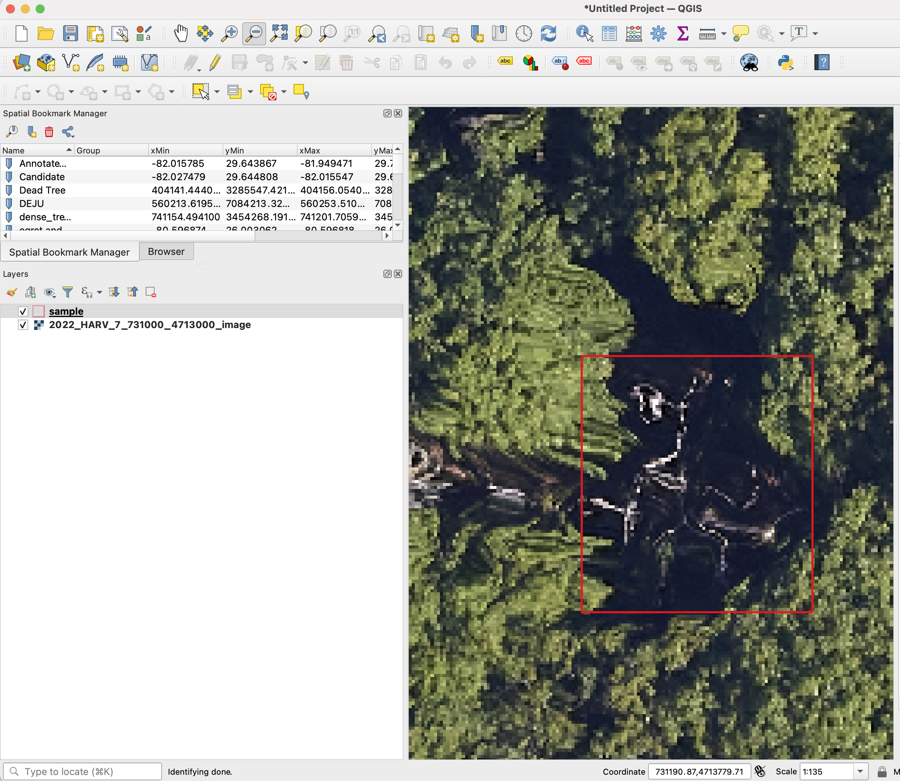
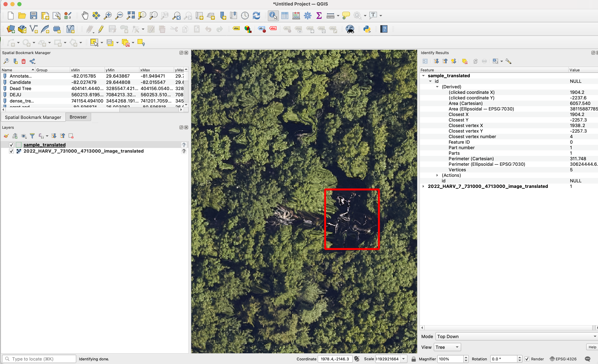
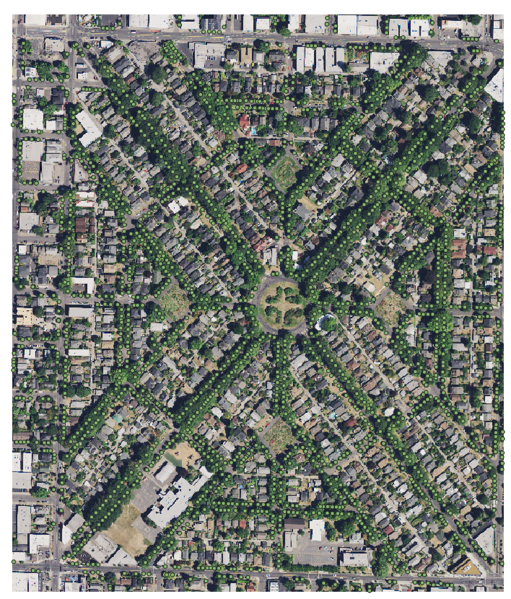
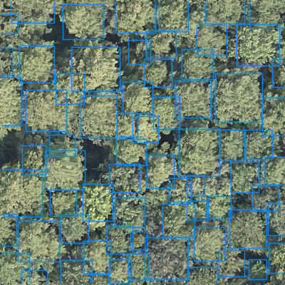

# Contributing

## Data

The essential data are:

1. **Airborne imagery**

    Drone or piloted aircraft preferred, we are not yet convinced about tree segmentation from satellite sources, but open to discussion. Preferably in .tif format with georeferencing.

2. **Tree annotations**

    Point, box, or polygon annotations of trees in the imagery. In shapefile format with matching georeferencing as the airborne imagery.

The spatial location of the points will be destroyed, such that the point locations will only be relative to the image crop. This will prevent any user from being able to use the data for analysis outside of the benchmark. All species, DBH and other metadata will be removed. For the images, if the geospatial location is the problem, as is it with many datasets, let the provider know that we are destroying the geospatial position, such that we crop images into pieces and remove the coordinate reference system and make any tree annotations relative to the 0,0 image origin, this way we are not releasing any geolocated data that might have privacy issues.

For open source data in which authors don't have concerns about privacy, the best way to contribute is to make data available on [Zenodo](https://zenodo.org/), and then make an issue in this repo documenting the location of the data. Your Zenodo record will now have a DOI that is citable. We are sensitive to the contributions and efforts of the hundreds of field researchers that make data collection possible. Authorship will be extended to any team with unpublished data.

## Removing spatial data projection

We are always happy to help assist in data curation. No actions are needed before sharing data. All data will be treated confidentially and shared according to the bullets above. However, if you prefer to remove the spatial projection before sharing the data, [here is a sample code to convert projected data into unprojected data](https://github.com/weecology/MillionTrees/blob/main/data_prep/destroy_geo.py).




## What does a successful dataset look like?

We welcome any geometric representation of trees in airborne imagery. Points, polygons, or boxes. Usually we ask for a shapefile or text coordinates of trees and a corresponding .tif geospatial file of airborne imagery. When you overlay the two, the data should look coherent. There has been a narrow view of the task that has been overly constrained by off-the-shelf architectures, rather than the essential nature of the task. Tree localization, counting, and crown detection are all interrelated tasks using geometric representations of trees. We should not design benchmarks around current model architectures, we should put the problem first and build architectures that meet that need.





## How will the data be shared?

After we work with an author to find a suitable data sharing agreement, we will remove the spatial information from the images and create a Zenodo record to document a train/test split for the benchmark. A manuscript, which all contributors are invited to join, will be published outlining the strengths, limitations, and potential uses of the dataset. The working document describing technical details of evaluation is still in its infancy is [here](https://docs.google.com/document/d/1K6G1tcdTuAv3FgGiDWq5QhO-kSoBrxzTiic5jH1CZF4/edit?usp=sharing).

## Worked Example: Adding a New Dataset

To contribute a new dataset, you need to process the data into the required format, generate an `annotations.csv` file, and include it in the `package_datasets.py` script. Below is a step-by-step guide using the Harz Mountains dataset as an example.

### Step 1: Process the Dataset

The Harz Mountains dataset consists of shapefiles with tree annotations and corresponding `.tif` images. The goal is to process these files into a single `annotations.csv` file that can be used by the MillionTrees framework.

This file should have each annotation as seperate row with the columns

* image_path: the full pathname to the image on disk
* source: the citation author for the dataset, e.g. 'Lucas et al. 2025'
* geometry: A shapely wkt object of the annotation. The coordinates are in the image pixels, not geographic coordinates.

```
>>> df[["source","image_path","geometry"]].iloc[0]
source                                        Lucas et al. 2024
image_path    /orange/ewhite/DeepForest/Harz_Mountains/ML_Tr...
geometry      POLYGON ((115.68613306900687 272.6810018740152...
Name: 0, dtype: object
```

