# Datasets
There are three datasets within the MillionTrees package: TreeBoxes, TreePoints, and TreePolygons. These datasets contain many source datasets from dozens of papers and research efforts. Below, each source is briefly described. The images for each dataset are generated directly from the dataloaders to allow rapid verification of the annotation status and are regenerated automatically when a new dataset is released or updated. Sample images within a dataset are *randomly selected* within  to ensure transparency. This does mean that some images are sparsely annotated compared to the rest of the images in a source.

*Note: The datasets below are processed and will be part of the final release. The current release is pre-release and not final. Only publically available datasets are included at this time.*

## Boxes

### Dumortier 2025

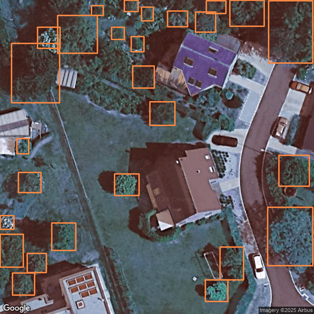

Cite: 10.5281/zenodo.15155080

https://zenodo.org/records/15155081

### Kaggle Palm Counting

### Kwon et al. 2023

**Citation:** Ryoungseob Kwon, Youngryel Ryu, Tackang Yang, Zilong Zhong, Jungho Im,  
*Merging multiple sensing platforms and deep learning empowers individual tree mapping and species detection at the city scale*,  
ISPRS Journal of Photogrammetry and Remote Sensing, Volume 206, 2023

**Location:** Suwon, South Korea

### Radogoshi et al. 2021 

**Link:** [https://lila.science/datasets/forest-damages-larch-casebearer/](https://lila.science/datasets/forest-damages-larch-casebearer/)

**Location:** Sweden

### Sun et al. 2022

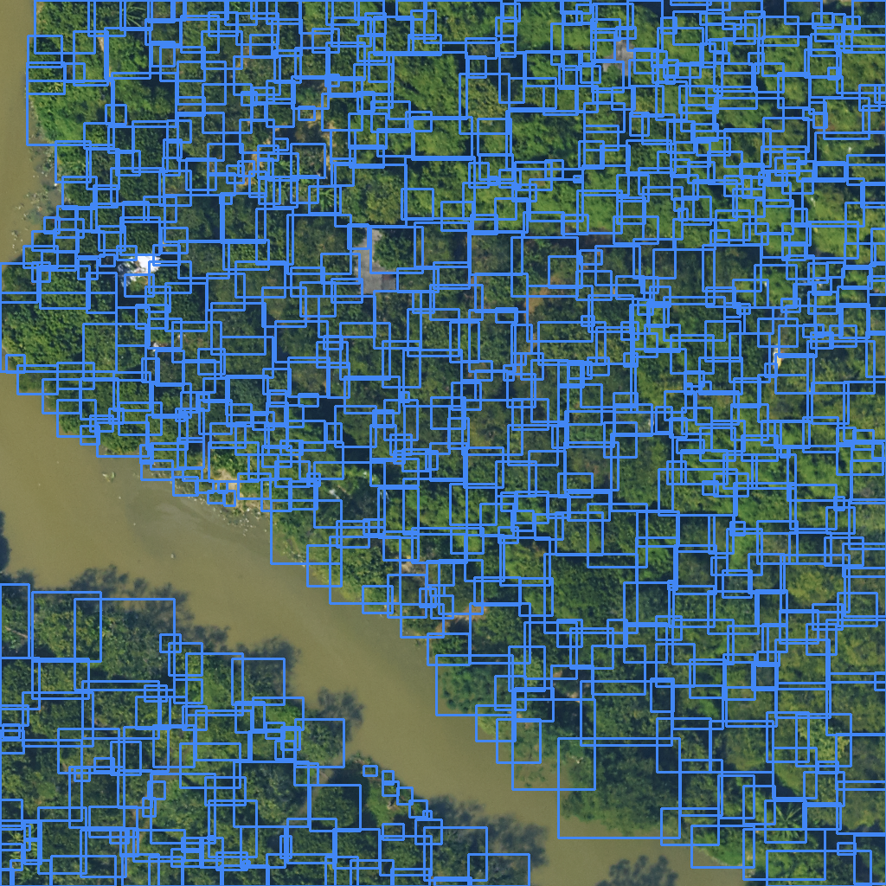

**Link:** [https://www.sciencedirect.com/science/article/pii/S030324342100369X](https://www.sciencedirect.com/science/article/pii/S030324342100369X)

### Santos et al. 2019

**Link:** [Dataset Ninja](https://datasetninja.com/tree-species-detection)  

**Citation**

@Article{s19163595,
  AUTHOR = {Santos, Anderson Aparecido dos and Marcato Junior, José and Araújo, Márcio Santos and Di Martini, David Robledo and Tetila, Everton Castelão and Siqueira, Henrique Lopes and Aoki, Camila and Eltner, Anette and Matsubara, Edson Takashi and Pistori, Hemerson and Feitosa, Raul Queiroz and Liesenberg, Veraldo and Gonçalves, Wesley Nunes},
  TITLE = {Assessment of CNN-Based Methods for Individual Tree Detection on Images Captured by RGB Cameras Attached to UAVs},
  JOURNAL = {Sensors},
  VOLUME = {19},
  YEAR = {2019},
  NUMBER = {16},
  ARTICLE-NUMBER = {3595},
  URL = {https://www.mdpi.com/1424-8220/19/16/3595},
DOI = {10.3390/s19163595}
}

**Location:** Barro Colorado Island, Panama

### Velasquez-Camacho et al. 2023

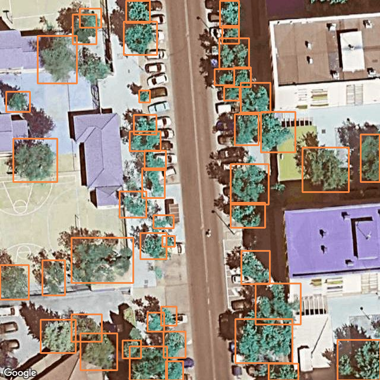

**Link:** [https://zenodo.org/records/10246449](https://zenodo.org/records/10246449)

**Location:** Spain

### Weinstein et al. 2021

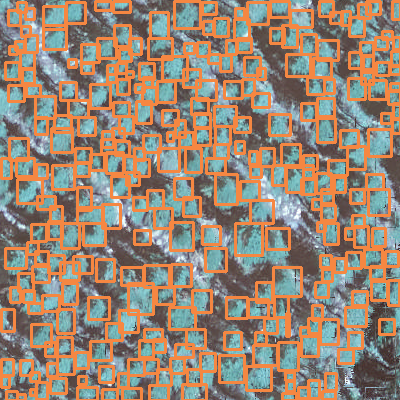

**Link:** https://journals.plos.org/ploscompbiol/article?id=10.1371/journal.pcbi.1009180

**Location** [NEON sites](https://www.neonscience.org/field-sites/explore-field-sites) within the United States

An extension of this published resource was made by the Weecology Lab at the University of Florida

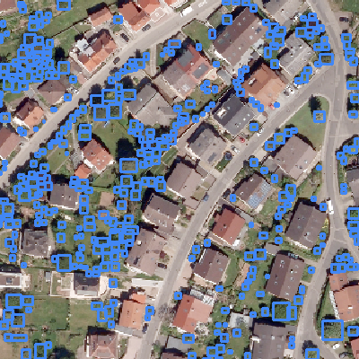

### World Resources Institute 

NAIP Imagery from across the United States

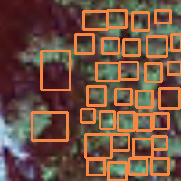

### Zamboni et al. 2022

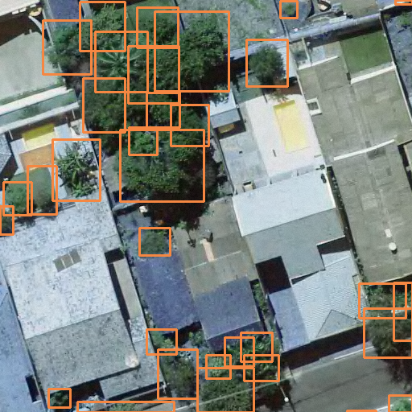

**Link:** [https://github.com/pedrozamboni/individual_urban_tree_crown_detection](https://github.com/pedrozamboni/individual_urban_tree_crown_detection)

**Location:** Mato Grosso do Sul, Brazil

## Points

### Amirkolaee et al. 2023

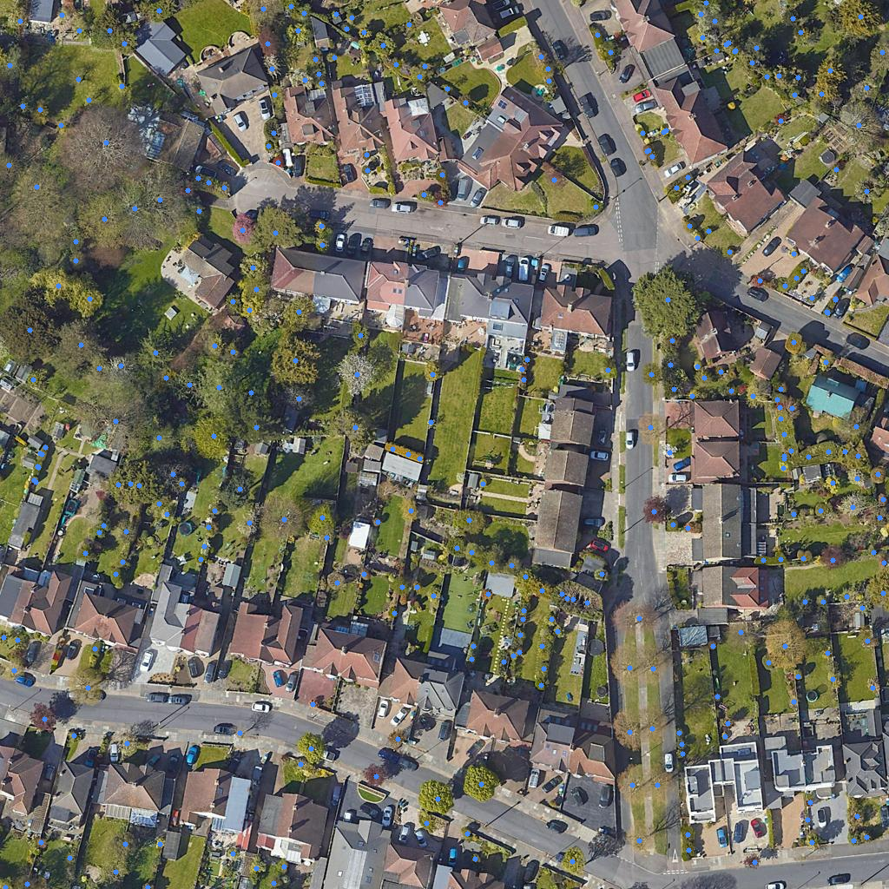

**Citation:** Amirkolaee, Hamed Amini, Miaojing Shi, and Mark Mulligan.  
*TreeFormer: a Semi-Supervised Transformer-based Framework for Tree Counting from a Single High Resolution Image*.  
IEEE Transactions on Geoscience and Remote Sensing (2023)

**Link:** [https://github.com/HAAClassic/TreeFormer](https://github.com/HAAClassic/TreeFormer)

**Location:** London, England

**Citation:** Lefebvre, I., Laliberté, E. (2024). UAV LiDAR, UAV Imagery, Tree Segmentations and Ground Mesurements for Estimating Tree Biomass in Canadian (Quebec) Plantations. Federated Research Data Repository. https://doi.org/10.20383/103.0979

### Ventura et al. 2022

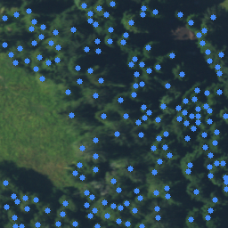

**Citation:** J. Ventura, C. Pawlak, M. Honsberger, C. Gonsalves, J. Rice, N.L.R. Love, S. Han, V. Nguyen, K. Sugano, J. Doremus, G.A. Fricker, J. Yost, and M. Ritter.  
*Individual Tree Detection in Large-Scale Urban Environments using High-Resolution Multispectral Imagery*.  
International Journal of Applied Earth Observation and Geoinformation, 130, 103848 (2024)

**Link:** [https://github.com/jonathanventura/urban-tree-detection-data](https://github.com/jonathanventura/urban-tree-detection-data)

**Location:** Southern California, United States

### National Ecological Observatory Network

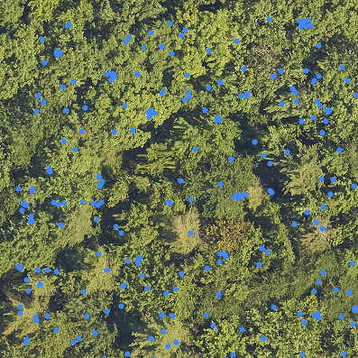

**Location:** Multiple sites across the United States, see [NEON Field Sites](https://www.neonscience.org/field-sites/explore-field-sites)

**Link:** [https://data.neonscience.org/data-products/DP1.10098.001](https://data.neonscience.org/data-products/DP1.10098.001)

### Tonga Trees

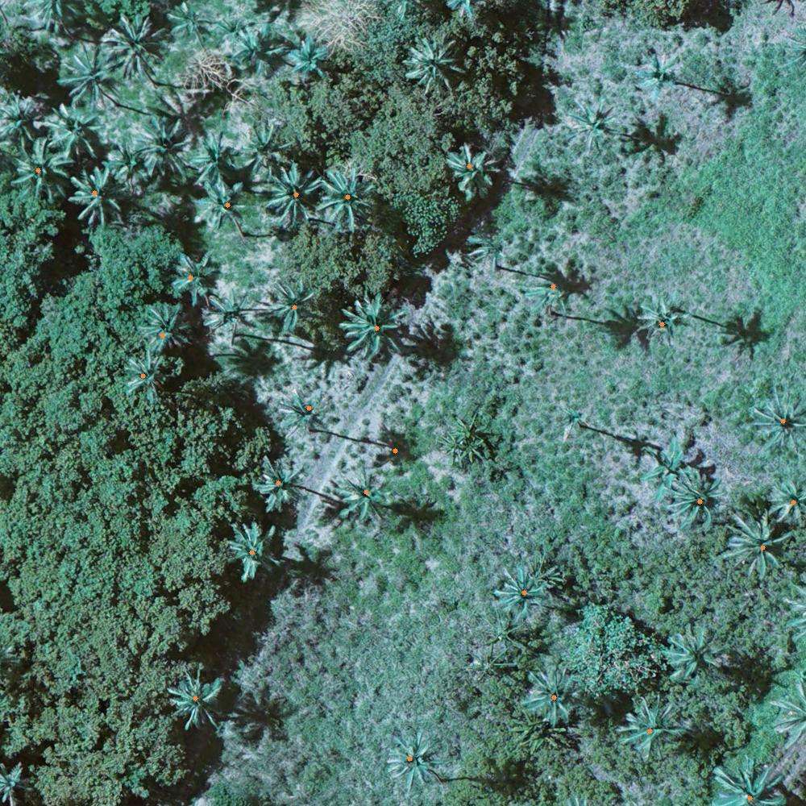

**Location:** Tonga

**Link:** The provenance of this project is unclear, it was used several times in ArcGIS tutorials, but no citation was given.

[https://learn.arcgis.com/en/projects/detect-objects-with-a-deep-learning-pretrained-model/](https://learn.arcgis.com/en/projects/detect-objects-with-a-deep-learning-pretrained-model/)

## Polygons

### Araujo et al. 2020

**Link:** [https://journals.plos.org/plosone/article?id=10.1371/journal.pone.0243079][https://journals.plos.org/plosone/article?id=10.1371/journal.pone.0243079]

**Location:** Manuas, Brazil

### Ball et al. 2023

**Link:** [https://zenodo.org/records/8136161](https://zenodo.org/records/8136161)

**Location:** Danum, Malaysia

## Bolhman 2008

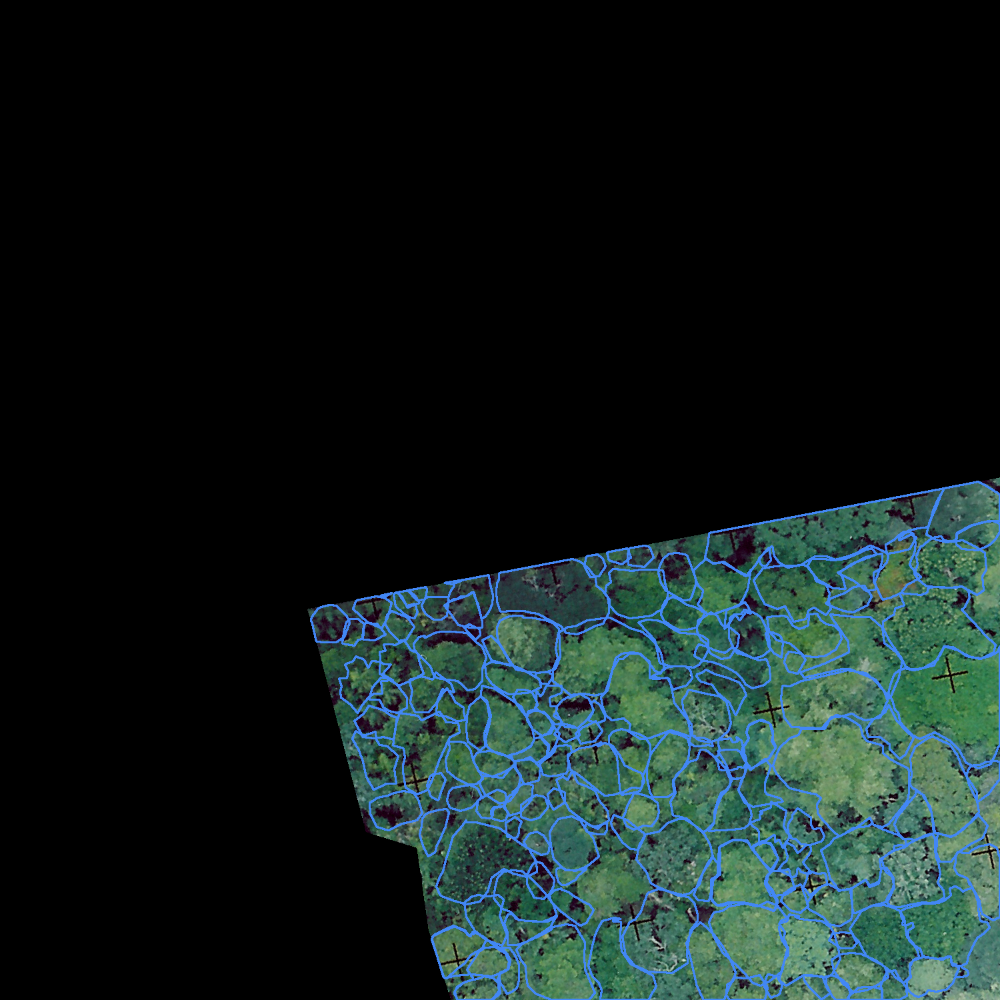

Unpublished data from Barro Colorado Island

**Location**: BCI, Panama

### Cloutier et al. 2023

**Link:** [https://zenodo.org/records/8148479](https://zenodo.org/records/8148479)

**Location:** Quebec, Canada

### Feng et al. 2025

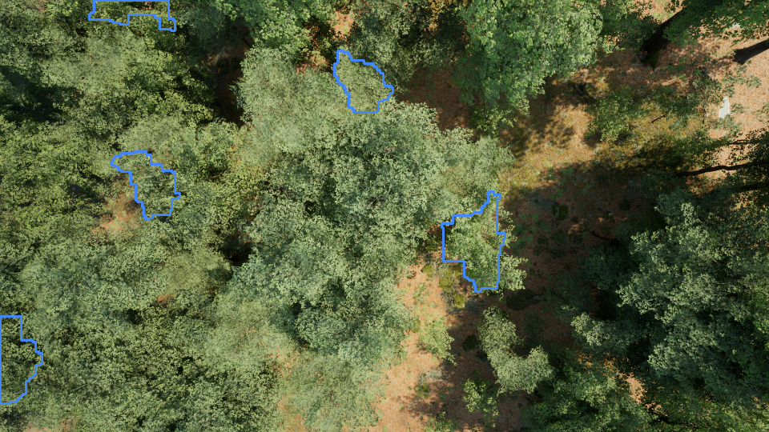

**Link:** [Zenodo](https://zenodo.org/records/14525290)
**Location:** Simulation

*Note this dataset is simulated and therefore somewhat more controvertial in its inclusion. We believe the size, diversity and realism of the images merit inclusion.*

### Firoze et al. 2023

**Link:** [https://openaccess.thecvf.com/content/CVPR2023/papers/Firoze_Tree_Instance_Segmentation_With_Temporal_Contour_Graph_CVPR_2023_paper.pdf](https://openaccess.thecvf.com/content/CVPR2023/papers/Firoze_Tree_Instance_Segmentation_With_Temporal_Contour_Graph_CVPR_2023_paper.pdf)

**Location:** Indiana, United States

### Hickman et al. 2021

**Link:** [https://zenodo.org/records/5515408](https://zenodo.org/records/5515408)

**Location:** Sabah, Malaysia

### Jansen et al. 2022

**Link:** [https://zenodo.org/records/7094916](https://zenodo.org/records/7094916)

**Location:** Northern Australia

### JustDiggit

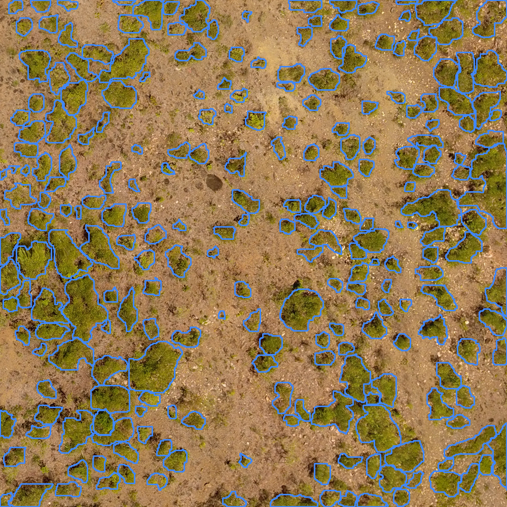

**Link:** [JustDigIt](https://justdiggit.org/news/machine-learning-model-to-track-trees/)

**Location:** Tanzania

Citation status uncertain, contact Tjomme Dooper fruit punch AI.

### Li et al. 2023

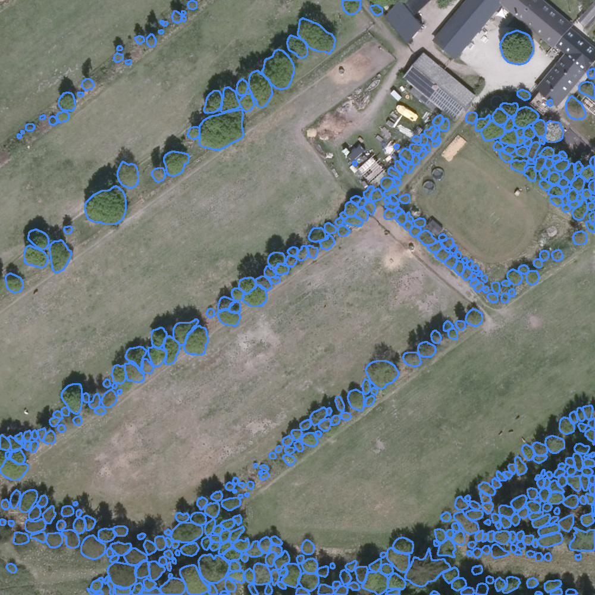

**link** [Manuscript](https://academic.oup.com/pnasnexus/article/2/4/pgad076/7073732?login=false) [github](https://github.com/sizhuoli/TreeCountSegHeight?tab=readme-ov-file)

**Location**: Denmark

### Lefebvre et al. 2024

[Dataset Link](https://www.frdr-dfdr.ca/repo/dataset/9f10a155-c89f-43ee-9864-da28ca436af6)

### Lucas et al. 2024

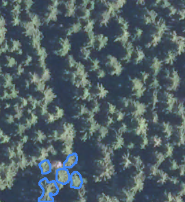

**Link:** [Manuscript](https://www.nw-fva.de/fileadmin/nwfva/publikationen/pdf/lucas_2024_individual_tree_detection_and_crown_delineation_in_the_harz.pdf) 

**Citation** Lucas, Moritz, et al. "Individual tree detection and crown delineation in the Harz National Park from 2009 to 2022 using mask R–CNN and aerial imagery." ISPRS Open Journal of Photogrammetry and Remote Sensing 13 (2024): 100071.

### Kattenborn et al. 2023

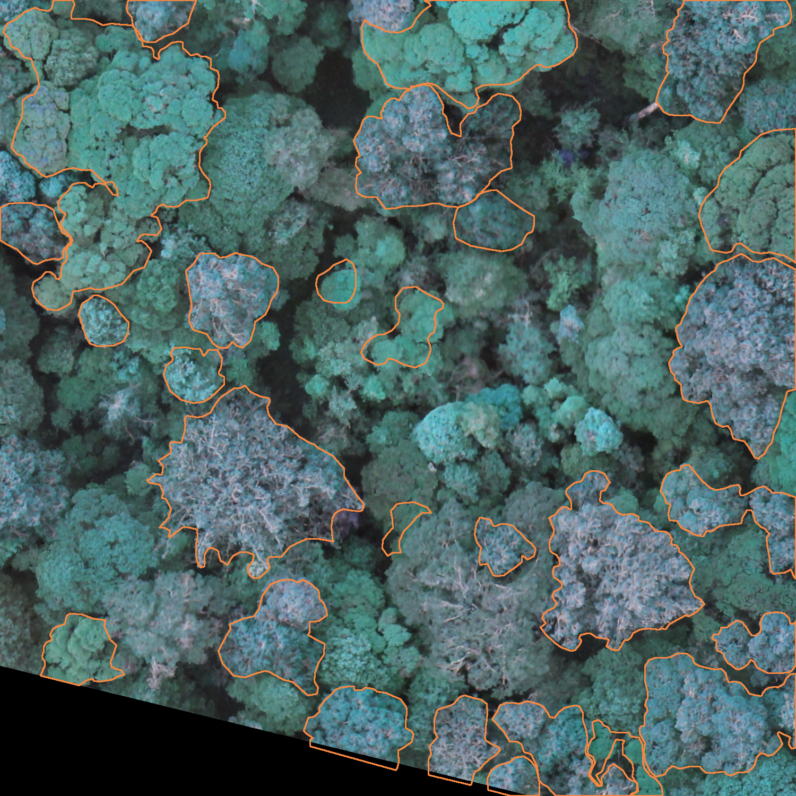

**Link:** [https://www.mdpi.com/1424-8220/21/5/1617](https://zslpublications.onlinelibrary.wiley.com/doi/full/10.1002/rse2.146)

**Location:** New Zealand

### Miranda et al. 2024

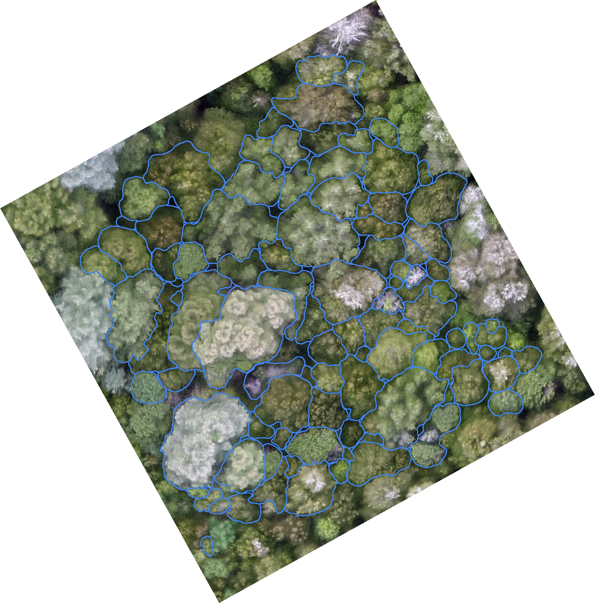

**Link:** [Courtesy of Alejandro Miranda](http://www.lepfor.ufro.cl/)

### Safonova et al. 2021

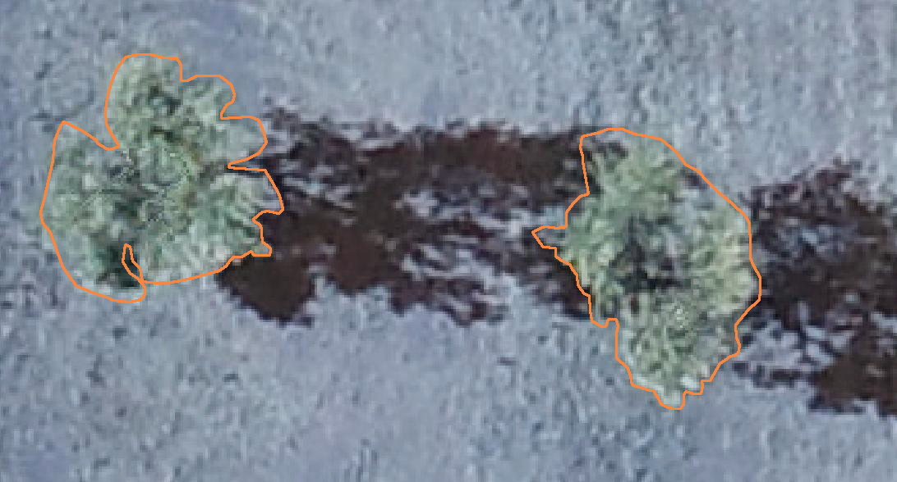

**Link:** [https://www.mdpi.com/1424-8220/21/5/1617](https://www.mdpi.com/1424-8220/21/5/1617)

**Location:** Spain

### Takeshige et al. 2025

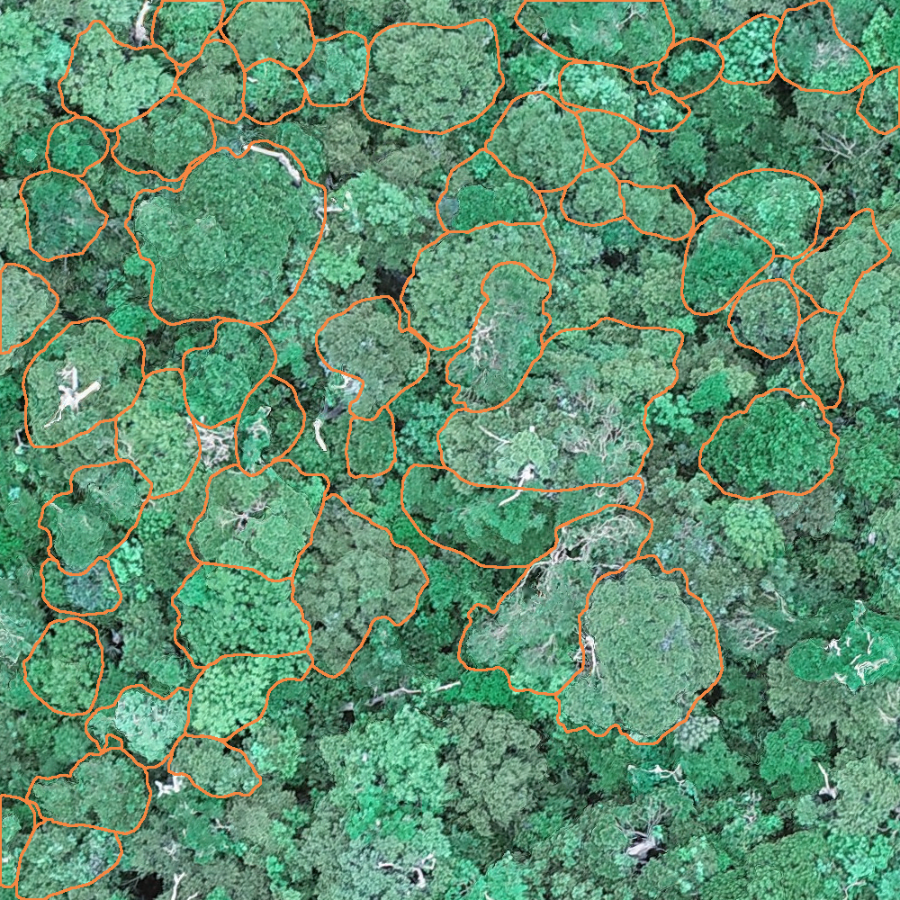

**Link:** https://esj-journals.onlinelibrary.wiley.com/doi/10.1111/1440-1703.12555

**Location:** Japan

### Troles et al. 2024

**Location:** Bamberg, Germany

### Wagner et al. 2023

**Link:** [https://www.mdpi.com/2504-446X/7/3/155](https://www.mdpi.com/2504-446X/7/3/155)  
[https://www.mdpi.com/2072-4292/16/11/1935](https://www.mdpi.com/2072-4292/16/11/1935)

**Location:** Australia

### Vasquez et al. 2023

**Link:** [Figshare](https://smithsonian.figshare.com/articles/dataset/Barro_Colorado_Island_50-ha_plot_crown_maps_manually_segmented_and_instance_segmented_/24784053?file=43684731)  

**Location:** Barro Colorado Island, Panama

There is also a training-only portion of this that was used in conjuction with a model to predict labels that were then verified. 
