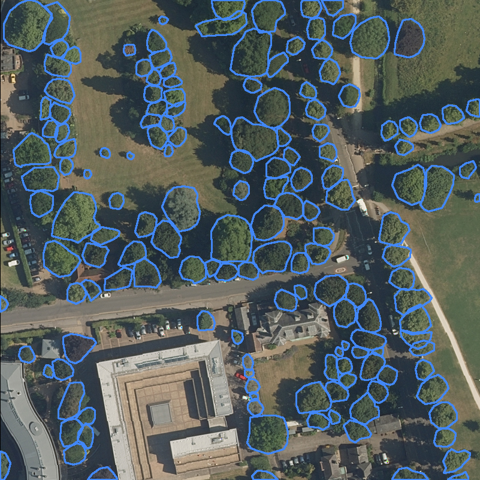

# Datasets
There are three datasets within the MillionTrees package: TreeBoxes, TreePoints, and TreePolygons. These datasets contain many source datasets from dozens of papers and research efforts. Below, each source is briefly described. The images for each dataset are generated directly from the dataloaders to allow rapid verification of the annotation status and are regenerated automatically when a new dataset is released or updated.

## Boxes

### Kwon et al. 2023

**Citation:** Ryoungseob Kwon, Youngryel Ryu, Tackang Yang, Zilong Zhong, Jungho Im,  
*Merging multiple sensing platforms and deep learning empowers individual tree mapping and species detection at the city scale*,  
ISPRS Journal of Photogrammetry and Remote Sensing, Volume 206, 2023

**Location:** Suwon, South Korea

### Ragadoshi_Sweden

**Link:** [https://lila.science/datasets/forest-damages-larch-casebearer/](https://lila.science/datasets/forest-damages-larch-casebearer/)

**Location:** Sweden

### Velasquez-Camacho et al. 2023

**Link:** [https://zenodo.org/records/10246449](https://zenodo.org/records/10246449)

**Location:** Spain

### Zamboni et al. 2022

**Link:** [https://github.com/pedrozamboni/individual_urban_tree_crown_detection](https://github.com/pedrozamboni/individual_urban_tree_crown_detection)

**Location:** Mato Grosso do Sul, Brazil

### World Resources Institute 

NAIP Imagery from across the United States

## Points

### Amirkolaee et al. 2023

**Citation:** Amirkolaee, Hamed Amini, Miaojing Shi, and Mark Mulligan.  
*TreeFormer: a Semi-Supervised Transformer-based Framework for Tree Counting from a Single High Resolution Image*.  
IEEE Transactions on Geoscience and Remote Sensing (2023)

**Link:** [https://github.com/HAAClassic/TreeFormer](https://github.com/HAAClassic/TreeFormer)

**Location:** London, England

### Ventura et al. 2022

**Citation:** J. Ventura, C. Pawlak, M. Honsberger, C. Gonsalves, J. Rice, N.L.R. Love, S. Han, V. Nguyen, K. Sugano, J. Doremus, G.A. Fricker, J. Yost, and M. Ritter.  
*Individual Tree Detection in Large-Scale Urban Environments using High-Resolution Multispectral Imagery*.  
International Journal of Applied Earth Observation and Geoinformation, 130, 103848 (2024)

**Link:** [https://github.com/jonathanventura/urban-tree-detection-data](https://github.com/jonathanventura/urban-tree-detection-data)

**Location:** Southern California, United States

## Polygons

### Zúñiga-González et al. 2023

**Link:** [https://zenodo.org/records/8113842](https://zenodo.org/records/8113842)

### Miranda et al. 2024

**Link:** [Courtesy of Alejandro Miranda](http://www.lepfor.ufro.cl/)

### Hickman et al. 2021

**Link:** [https://zenodo.org/records/5515408](https://zenodo.org/records/5515408)

**Location:** Sabah, Malaysia

### Ball et al. 2023

**Link:** [https://zenodo.org/records/8136161](https://zenodo.org/records/8136161)

**Location:** Danum, Malaysia

### Cloutier et al. 2023

**Link:** [https://zenodo.org/records/8148479](https://zenodo.org/records/8148479)

**Location:** Quebec, Canada

### Firoze et al. 2023

**Link:** [https://openaccess.thecvf.com/content/CVPR2023/papers/Firoze_Tree_Instance_Segmentation_With_Temporal_Contour_Graph_CVPR_2023_paper.pdf](https://openaccess.thecvf.com/content/CVPR2023/papers/Firoze_Tree_Instance_Segmentation_With_Temporal_Contour_Graph_CVPR_2023_paper.pdf)

**Location:** Indiana, United States

### Jansen et al. 2022

**Link:** [https://zenodo.org/records/7094916](https://zenodo.org/records/7094916)

**Location:** Northern Australia

### Safonova et al. 2021

**Link:** [https://www.mdpi.com/1424-8220/21/5/1617](https://www.mdpi.com/1424-8220/21/5/1617)

**Location:** Spain

### Troles et al. 2024

**Location:** Bamberg, Germany

### Wagner et al. 2023

**Link:** [https://www.mdpi.com/2504-446X/7/3/155](https://www.mdpi.com/2504-446X/7/3/155)  
[https://www.mdpi.com/2072-4292/16/11/1935](https://www.mdpi.com/2072-4292/16/11/1935)

**Location:** Australia
