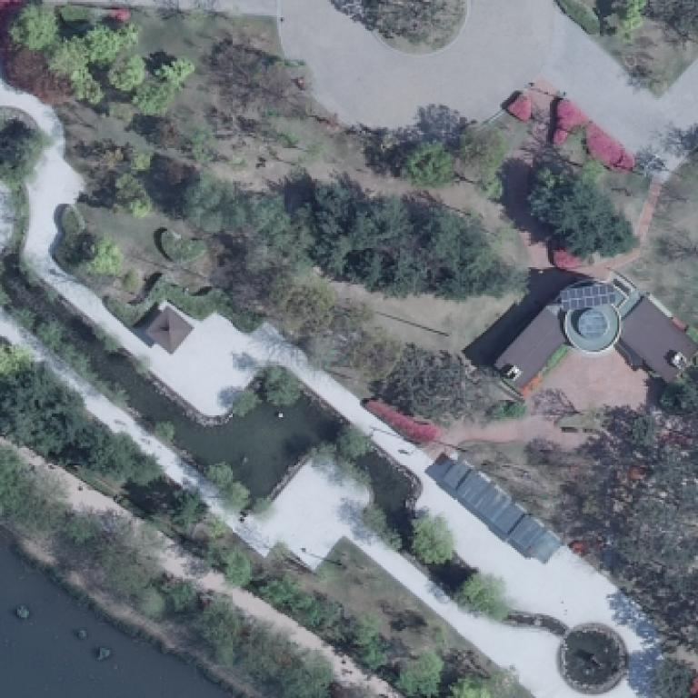
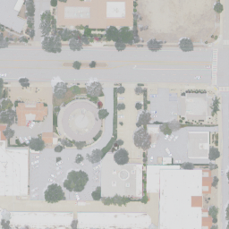

# Datasets

There are three datasets within the MillionTrees package, TreeBoxes, TreePoints, TreePolygons. Those datasets contain many source datasets from dozens of papers and research efforts. Below, each source is briefly described.

## Points

### Amirkolaee et al. 2023

Citation: Amirkolaee, Hamed Amini, Miaojing Shi, and Mark Mulligan. "TreeFormer: a Semi-Supervised Transformer-based Framework for Tree Counting from a Single High Resolution Image." IEEE Transactions on Geoscience and Remote Sensing (2023). https://github.com/HAAClassic/TreeFormer

Location: London, England

### Ventura et al. 2022

Citation: 

J. Ventura, C. Pawlak, M. Honsberger, C. Gonsalves, J. Rice, N.L.R. Love, S. Han, V. Nguyen, K. Sugano, J. Doremus, G.A. Fricker, J. Yost, and M. Ritter (2024). Individual Tree Detection in Large-Scale Urban Environments using High-Resolution Multispectral Imagery. International Journal of Applied Earth Observation and Geoinformation, 130, 103848. https://github.com/jonathanventura/urban-tree-detection-data

Location: Southern California, United States

## Boxes

### Velasquez-Camacho et al. 2023

https://zenodo.org/records/10246449

Location: Spain

### Kwon et al. 2023

Citation: Ryoungseob Kwon, Youngryel Ryu, Tackang Yang, Zilong Zhong, Jungho Im,
Merging multiple sensing platforms and deep learning empowers individual tree mapping and species detection at the city scale,
ISPRS Journal of Photogrammetry and Remote Sensing, Volume 206, 2023,

Location: Suwon, South Korea

### Zamboni et al. 2022

https://github.com/pedrozamboni/individual_urban_tree_crown_detection

Location: Mato Grosso do Sul, Brazil

## Polygons

### Jansen et al. 2022

Location: Northern Australia

https://zenodo.org/records/7094916

### Cloutier et al. 2023

https://zenodo.org/records/8148479

Location: Quebec, Canada

### Troles et al. 2024

Location: Bamberg, Germany

### Firoze et al. 2023

https://openaccess.thecvf.com/content/CVPR2023/papers/Firoze_Tree_Instance_Segmentation_With_Temporal_Contour_Graph_CVPR_2023_paper.pdf

Location: Indiana, United States

#### Ball et al. 2023

https://zenodo.org/records/8136161

Location: Danum, Malaysia

## Wagner et al. 2023

https://www.mdpi.com/2504-446X/7/3/155

Location: Australia
https://www.mdpi.com/2072-4292/16/11/1935
