# Datasets
There are three datasets within the MillionTrees package: TreeBoxes, TreePoints, and TreePolygons. These datasets contain many source datasets from dozens of papers and research efforts. Below, each source is briefly described. The images for each dataset are generated directly from the dataloaders to allow rapid verification of the annotation status and are regenerated automatically when a new dataset is released or updated. Sample images within a dataset are *randomly selected* to ensure transparency. This does mean that some images are sparsely annotated compared to the rest of the images in a source.

*Note: The datasets below are processed and will be part of the final release. The current release is pre-release and not final. Only publicly available datasets are included at this time.*

## Dataset Filtering and Management

MillionTrees datasets can contain millions of annotations. Use filtering capabilities to manage dataset size and preview data before downloading.

### Source Filtering

List and filter available sources:

```py
from milliontrees.datasets.TreePoints import TreePointsDataset
dataset = TreePointsDataset()
sources = dataset.sources
print("Available sources:", sources)
# Available sources: ['Kattenborn_NewZealand', 'NeonTreeEvaluation', 'OFO_unsupervised', 'NEON_unsupervised'...]
```

Include only specific sources:

```py
dataset = TreePointsDataset(
  include_sources=['Amirkolaee et al. 2023']
)
```

Exclude specific sources (exact names or glob patterns supported):

```py
# Exclude a single source by name
dataset = TreePointsDataset(exclude_sources=['NEON_unsupervised'])

# Exclude by pattern (wildcards)
dataset = TreePointsDataset(exclude_sources=['*_unsupervised'])
```

## Release sizes (mini, small, full)

Each geometry dataset is published in three sizes:

- **mini** (`mini=True`): up to 3 images per source; `random` split only — fastest smoke tests.
- **small** (`small=True`): up to 50 images per source; all split schemes (`random`, `zeroshot`, `crossgeometry`).
- **full** (default): complete packaged release.

```python
dataset = TreePointsDataset(mini=True)
dataset = TreeBoxesDataset(small=True, split_scheme="zeroshot")
```

Do not pass `mini=True` and `small=True` together.
# Boxes

## Dumortier 2025


**Citation:** Dumortier, J. (2025). Annotated tree crown bounding boxes in urban/rural environment [Data set]. Zenodo. https://doi.org/10.5281/zenodo.15155081

**Link:** [https://zenodo.org/records/15155081](https://zenodo.org/records/15155081)

## Kaggle Palm Counting

### Source Name: "Kaggle_Palm_Counting"

https://www.kaggle.com/datasets/praneethsaikolla/palm-tree-detection-dataset


## Kwon et al. 2023


**Citation:** Ryoungseob Kwon, Youngryel Ryu, Tackang Yang, Zilong Zhong, Jungho Im,  
*Merging multiple sensing platforms and deep learning empowers individual tree mapping and species detection at the city scale*,  
ISPRS Journal of Photogrammetry and Remote Sensing, Volume 206, 2023

**Location:** Suwon, South Korea

## Radogoshi et al. 2021 

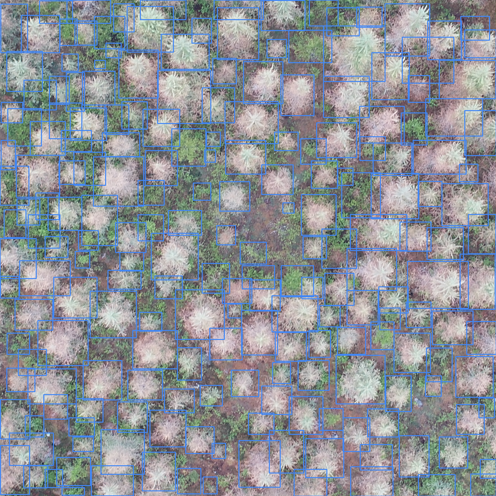

**Link:** [https://lila.science/datasets/forest-damages-larch-casebearer/](https://lila.science/datasets/forest-damages-larch-casebearer/)

**Dataset citation:** Swedish Forest Agency (2021): Forest Damages – Larch Casebearer 1.0. National Forest Data Lab. Dataset.

**Location:** Sweden

## Sun et al. 2022


**Link:** [https://www.sciencedirect.com/science/article/pii/S030324342100369X](https://www.sciencedirect.com/science/article/pii/S030324342100369X)

## Santos et al. 2019


**Link:** [Dataset Ninja](https://datasetninja.com/tree-species-detection)  

**Citation**

@Article{s19163595,
  AUTHOR = {Santos, Anderson Aparecido dos and Marcato Junior, José and Araújo, Márcio Santos and Di Martini, David Robledo and Tetila, Everton Castelão and Siqueira, Henrique Lopes and Aoki, Camila and Eltner, Anette and Matsubara, Edson Takashi and Pistori, Hemerson and Feitosa, Raul Queiroz and Liesenberg, Veraldo and Gonçalves, Wesley Nunes},
  TITLE = {Assessment of CNN-Based Methods for Individual Tree Detection on Images Captured by RGB Cameras Attached to UAVs},
  JOURNAL = {Sensors},
  VOLUME = {19},
  YEAR = {2019},
  NUMBER = {16},
  ARTICLE-NUMBER = {3595},
  URL = {https://www.mdpi.com/1424-8220/19/16/3595},
DOI = {10.3390/s19163595}
}

**Location:** Barro Colorado Island, Panama

## Velasquez-Camacho et al. 2023

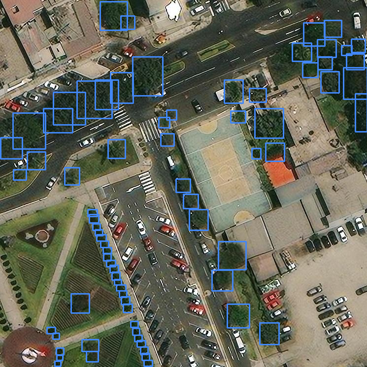

**Link:** [https://zenodo.org/records/10246449](https://zenodo.org/records/10246449)

**Location:** Spain

## Weinstein et al. 2021


**Link:** [https://journals.plos.org/ploscompbiol/article?id=10.1371/journal.pcbi.1009180](https://journals.plos.org/ploscompbiol/article?id=10.1371/journal.pcbi.1009180)

**Location:** [NEON sites](https://www.neonscience.org/field-sites/explore-field-sites) within the United States

An extension of this published resource was made by the Weecology Lab at the University of Florida


## World Resources Institute 

NAIP Imagery from across the United States

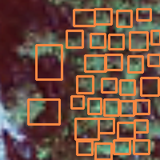

## SelvaBox (CanopyRS)


**Citation:** SelvaBox: A high-resolution dataset for tropical tree crown detection in dense canopies  
**Link:** [https://huggingface.co/datasets/CanopyRS/SelvaBox](https://huggingface.co/datasets/CanopyRS/SelvaBox)  
**Location:** Brazil, Ecuador, and Panama  
**Description:** High-resolution dataset (4.5 cm GSD) with over 83,000 human bounding box annotations for tropical tree crowns in dense canopies. The dataset comprises 14 rasters from three different countries with varying spatial extents.

## Veitch-Michaelis et al. 2024.

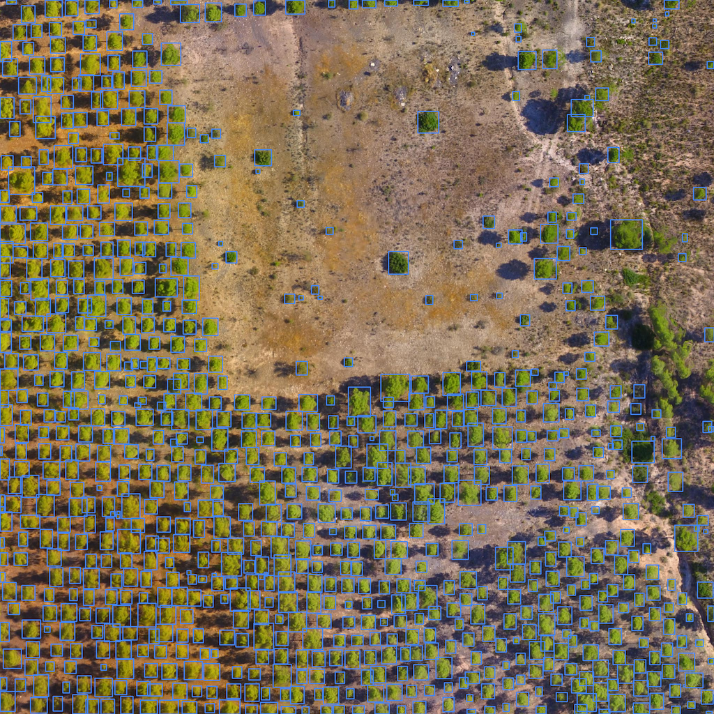

**Link:** [HuggingFace Dataset](https://huggingface.co/datasets/restor/tcd)

https://zenodo.org/records/11617167


**Location:** Global

**Citation:**  Veitch-Michaelis, J., Cottam, A., Schweizer, D., Broadbent, E., Dao, D., Zhang, C., Almeyda Zambrano, A., & Max, S. (2024). OAM-TCD: A globally diverse dataset of high-resolution tree cover maps (1.0.0) [Data set]. Zenodo.

For more information about the dataset collation, see: Veitch-Michaelis, J. et al. "OAM-TCD: A globally diverse dataset of high-resolution tree cover maps." Advances in neural information processing systems 37 (2024): 49749-49767.

## Zamboni et al. 2021

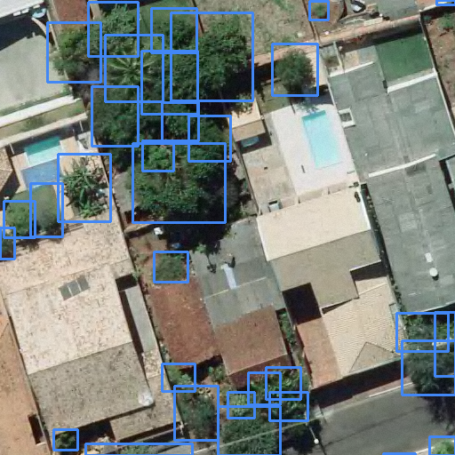

**Link:** [https://github.com/pedrozamboni/individual_urban_tree_crown_detection](https://github.com/pedrozamboni/individual_urban_tree_crown_detection)

**Location:** Mato Grosso do Sul, Brazil

## Puliti and Astrup 2022

### Source Name: "Puliti and Astrup 2022"


**Link:** [https://zenodo.org/records/14711562](https://zenodo.org/records/14711562)

**Location:** Norway

NIBIO UAV tree damage dataset. YOLO-format bounding boxes for individual trees over Norwegian forest sites; all classes are combined as `Tree` for the MillionTrees benchmark.

## Reiersen et al. 2022

### Source Name: "Reiersen et al. 2022"


**Location:** Ecuador

ReForestTree dataset. Bounding boxes were generated by running DeepForest and then human-cleaned, so this source is used for training only and not for evaluation.

## Šrollerů et al. 2025

### Source Name: "Šrollerů et al. 2025"

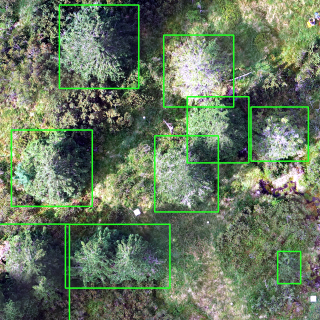

**Link:** [https://zenodo.org/records/15591546](https://zenodo.org/records/15591546)

**Location:** Krkonoše Mountains (Bílé Labe Valley), Czechia

UAV, aerial, and terrestrial 3D point clouds from a treeline ecotone with tree-level reference ground-based measurements across three plots (low/mid/high upper-forest limit). LiDAR-derived crown bounding boxes are projected into the matching orthoimagery for MillionTrees.

## Allen et al. 2025

### Source Name: "Allen et al. 2025"


**Citation:** Allen, M.J., Owen, H.J.F., Grieve, S.W.D., & Lines, E.R. Manual Labelling Artificially Inflates Deep Learning-Based Segmentation Performance on RGB Images of Closed Canopy: Validation Using TLS. *Remote Sensing of Environment* (in press). [https://arxiv.org/pdf/2503.14273](https://arxiv.org/pdf/2503.14273)

**Location:** Joensuu, Finland (boreal) and Alto Tajo, Spain (Mediterranean)

Axis-aligned bounding boxes derived from TLS crown footprints projected into drone orthomosaics. All rows are assigned to the ``validation`` split — held out for independent post-hoc evaluation, not hyperparameter tuning.

# Points

## Amirkolaee et al. 2023


**Citation:** Amirkolaee, Hamed Amini, Miaojing Shi, and Mark Mulligan. "TreeFormer: A semi-supervised transformer-based framework for tree counting from a single high-resolution image." *IEEE Transactions on Geoscience and Remote Sensing* 61 (2023): 1–15.

**Link:** [https://github.com/HAAClassic/TreeFormer](https://github.com/HAAClassic/TreeFormer)

**Location:** London, England

**GSD:** 0.2m

## Dubrovin et al. 2024

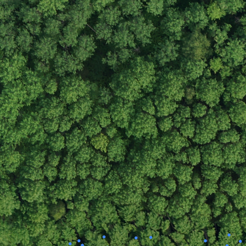

**Link:** [Kaggle Dataset](https://www.kaggle.com/datasets/sentinel3734/tree-detection-lidar-rgb)

UAV orthomosaics with accompanying field-survey tree locations. We include the field survey points as per-image point annotations for individual trees.

**Location:** Perm Krai, Russia

**Citation:** Dubrovin, Ivan, Clement Fortin, and Alexander Kedrov. "An open dataset for individual tree detection in UAV LiDAR point clouds and RGB orthophotos in dense mixed forests." *Scientific Reports* 14.1 (2024): 21938.

**Link (article):** [https://www.nature.com/articles/s41598-024-72669-5](https://www.nature.com/articles/s41598-024-72669-5)

**DOI:** https://doi.org/10.1038/s41598-024-72669-5

## Ventura et al. 2022

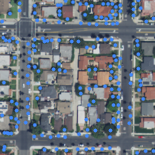

**Citation:** J. Ventura, C. Pawlak, M. Honsberger, C. Gonsalves, J. Rice, N.L.R. Love, S. Han, V. Nguyen, K. Sugano, J. Doremus, G.A. Fricker, J. Yost, and M. Ritter.  
*Individual Tree Detection in Large-Scale Urban Environments using High-Resolution Multispectral Imagery*.  
International Journal of Applied Earth Observation and Geoinformation, 130, 103848 (2024)

**Link:** [https://github.com/jonathanventura/urban-tree-detection-data](https://github.com/jonathanventura/urban-tree-detection-data)

**Location:** Southern California, United States

**GSD:** 0.6m

## National Ecological Observatory Network


**Location:** Multiple sites across the United States, see [NEON Field Sites](https://www.neonscience.org/field-sites/explore-field-sites)

**Link:** [https://data.neonscience.org/data-products/DP1.10098.001](https://data.neonscience.org/data-products/DP1.10098.001)

**GSD**: 0.1m 

## Auto-arborist

The auto-arborist dataset is a compilation of street-level surveys performed by local cities. Street trees were labeled with points. Annotations are limited to street trees, and do not include non-street trees. MillionTrees datasets are associated with state orthophoto programs that vary in ground resolution, from 20cm to 60cm. 

https://google.github.io/auto-arborist/

**Citation**: 
Sara Beery, Guanhang Wu, Trevor Edwards, Filip Pavetic, Bo Majewski, Shreyasee Mukherjee, Stanley Chan, John Morgan, Vivek Rathod, Jonathan Huang; Proceedings of the IEEE/CVF Conference on Computer Vision and Pattern Recognition (CVPR), 2022, pp. 21294-21307

**GSD**: 0.2m - 0.6m

## Chen and Shang 2022

### Source Name: "Chen & Shang (2022)"

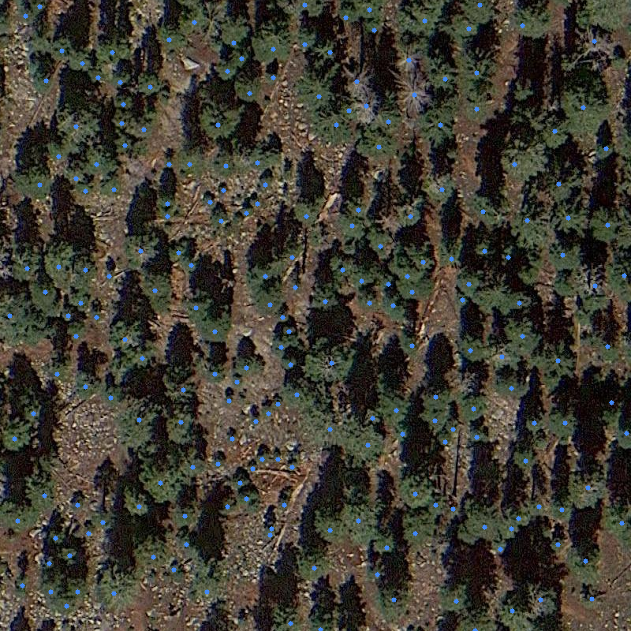

**Location:** Yosemite National Park, California, USA

Density-map annotations from the Yosemite tree counting dataset, converted to per-tree points via morphological centroid extraction.

## OSBS megaplot 2025

### Source Name: "OSBS megaplot 2025"


**Location:** Ordway-Swisher Biological Station (NEON OSBS site), Florida, USA

Field-mapped visible-tree stems from the 2025 OSBS megaplot survey, paired with the OSBS 2025 RGB mosaic and split into uniform image tiles.

## Young et al. 2025

### Source Name: "OFO field 2025"

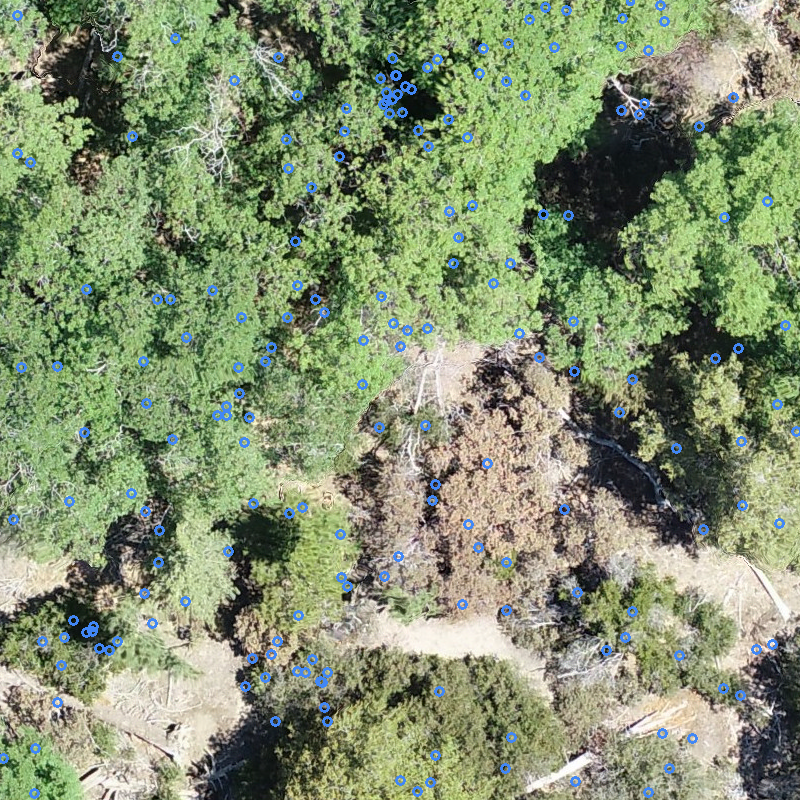

**Link:** [Open Forest Observatory](https://openforestobservatory.org/)

Field-validated stem maps from the Open Forest Observatory ground reference catalog. David Young
(UC Davis) shared a concatenated set of 330 plot-drone pairs in which each tree has been manually
mapped on the ground and the plot has been algorithmically registered to a specific drone mission's
photogrammetry products. The field trees are duplicated per overlapping mission with a
``mission_id`` attribute denoting which orthomosaic each row should be paired with, and a
``withhold_from_training`` flag that routes those trees to the test split.

The dataset is built by ``data_prep/process_ofo_field.py``, which downloads the matching
``missions_03`` orthomosaic for each ``mission_id`` from
``https://js2.jetstream-cloud.org:8001/swift/v1/ofo-public/drone/missions_03/{mission_id}/photogrammetry_03/full/{mission_id}_ortho-dsm-ptcloud.tif``,
tiles it into uniform patches, and projects field-tree points into image coordinates. Trees that
are not flagged ``predicted_overstory`` (overhead visible) are dropped by default since field stems
under the canopy cannot be observed from nadir drone imagery.

***Location*** Forests across California (Sierra Nevada and Lake Tahoe basin), USA

## Allen et al. 2025

### Source Name: "Allen et al. 2025"


**Citation:** Allen, M.J., Owen, H.J.F., Grieve, S.W.D., & Lines, E.R. Manual Labelling Artificially Inflates Deep Learning-Based Segmentation Performance on RGB Images of Closed Canopy: Validation Using TLS. *Remote Sensing of Environment* (in press). [https://arxiv.org/pdf/2503.14273](https://arxiv.org/pdf/2503.14273)

**Location:** Joensuu, Finland (boreal) and Alto Tajo, Spain (Mediterranean)

Tree-top points at polygon centroids from TLS-derived crown footprints. All rows use the ``validation`` split.

## Gominski et al. 2025 (tinytrees)

### Source Names: "Gominski et al. 2025 PlanetScope", "Gominski et al. 2025 Gaofen-2"

**Citation:** Gominski, D., Brandt, M., Tong, X., Liu, S., Mugabowindekwe, M., Li, S., Reiner, F., Davies, A., & Fensholt, R. *Trees as Gaussians: Large-Scale Individual Tree Mapping*. arXiv preprint [arXiv:2508.21437](https://arxiv.org/abs/2508.21437) (2025).

**Location:** Global (stratified by biomes)

**GSD:** 3.0 m (PlanetScope) and 0.8 m (Gaofen-2)

Hand-drawn point labels made through photointerpretation of satellite imagery, with help from higher-resolution products overlaid (e.g. Google Earth). Trees on satellite imagery are tiny and difficult to distinguish from the background; this is a challenging dataset. Each sensor ships with point labels and *labeling rectangles* delimiting where annotation is exhaustive — MillionTrees crops the rasters to those rectangles so all trees within each tile are labeled. Two source names are used so the two sensors keep distinct ground sample distances for per-source evaluation thresholds. Rows enter the ``random`` train/test split; this source is **not** held out as a zero-shot test source for points.

# Polygons

## Araujo et al. 2020


**Link:** [https://journals.plos.org/plosone/article?id=10.1371/journal.pone.0243079](https://journals.plos.org/plosone/article?id=10.1371/journal.pone.0243079)

**Location:** Manuas, Brazil

## Ball et al. 2023

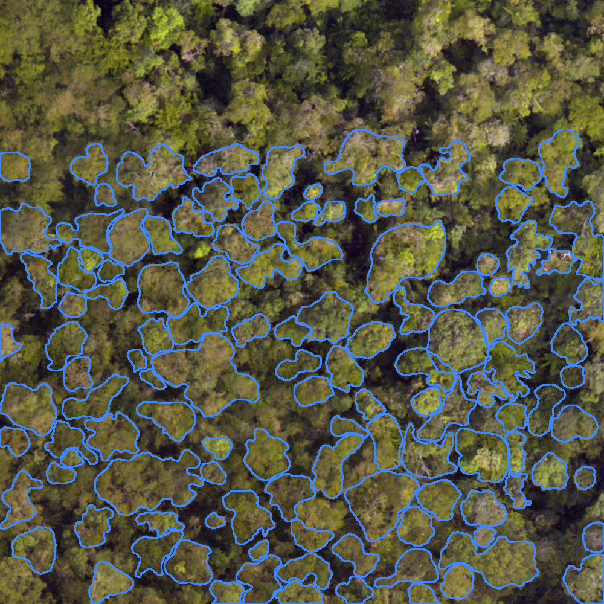

**Link:** [https://zenodo.org/records/8136161](https://zenodo.org/records/8136161)

**Location:** Danum, Malaysia

## Bohlman 2008

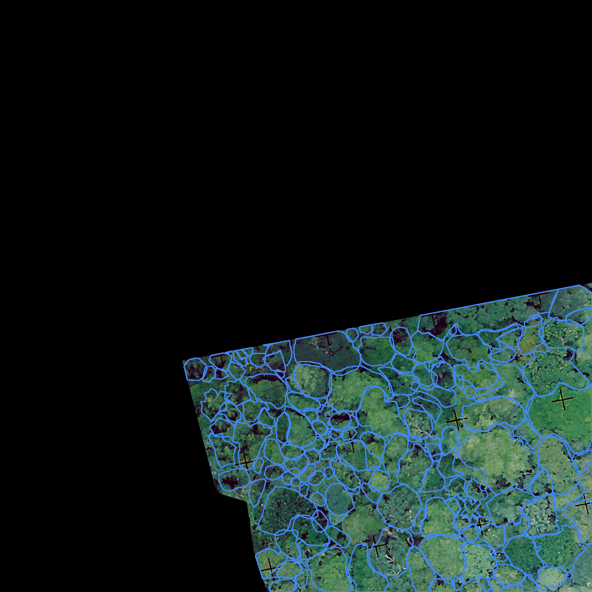

Unpublished data from Barro Colorado Island, field verified after photo-interpretation.

Both crowns and points are available.

**Location**: BCI, Panama

## Cloutier et al. 2023

### Source Name: "Cloutier et al. 2023"


**Link:** [https://zenodo.org/records/8148479](https://zenodo.org/records/8148479)

**Location:** Quebec, Canada

## Feng et al. 2025

## Source Name: 'Feng et al. 2025' 

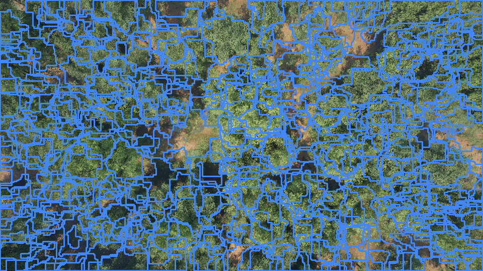

**Citation:** Feng, Zhengpeng, Yihang She, and Srinivasan Keshav. "SPREAD: A large-scale, high-fidelity synthetic dataset for multiple forest vision tasks." *Ecological Informatics* 87 (2025): 103085.

**Link:** [Zenodo](https://zenodo.org/records/14525290)

**Location:** Simulation

*Note this dataset is simulated and therefore somewhat more controvertial in its inclusion. We believe the size, diversity and realism of the images merit inclusion.*

## Firoze et al. 2023

### Source Name: "Firoze et al. 2023"


**Link:** [https://openaccess.thecvf.com/content/CVPR2023/papers/Firoze_Tree_Instance_Segmentation_With_Temporal_Contour_Graph_CVPR_2023_paper.pdf](https://openaccess.thecvf.com/content/CVPR2023/papers/Firoze_Tree_Instance_Segmentation_With_Temporal_Contour_Graph_CVPR_2023_paper.pdf)

**Location:** Indiana, United States

## Hickman et al. 2021

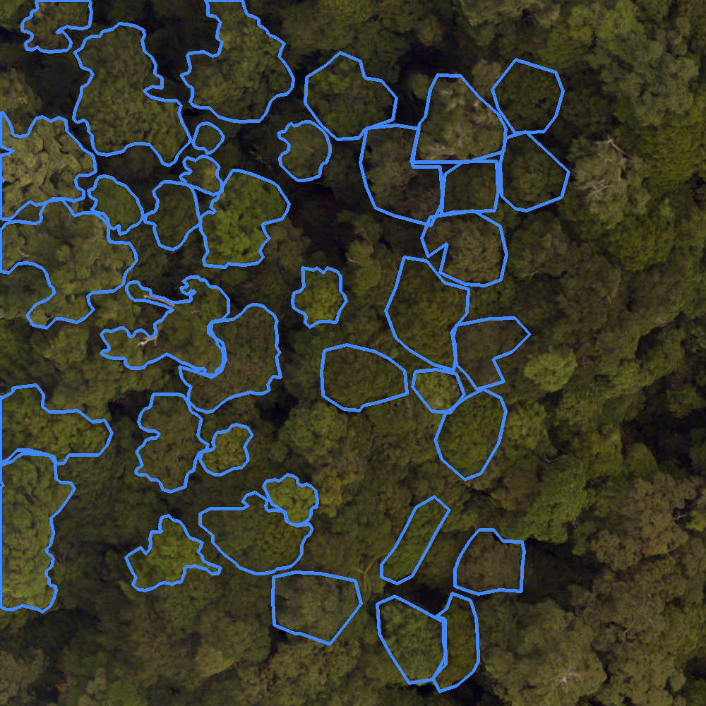

**Link:** [https://zenodo.org/records/5515408](https://zenodo.org/records/5515408)

**Location:** Sabah, Malaysia

## Jansen et al. 2023


**Link:** [https://zenodo.org/records/7094916](https://zenodo.org/records/7094916)

**Location:** Northern Australia

## JustDiggit

### Source Name: "Justdiggit 2023"

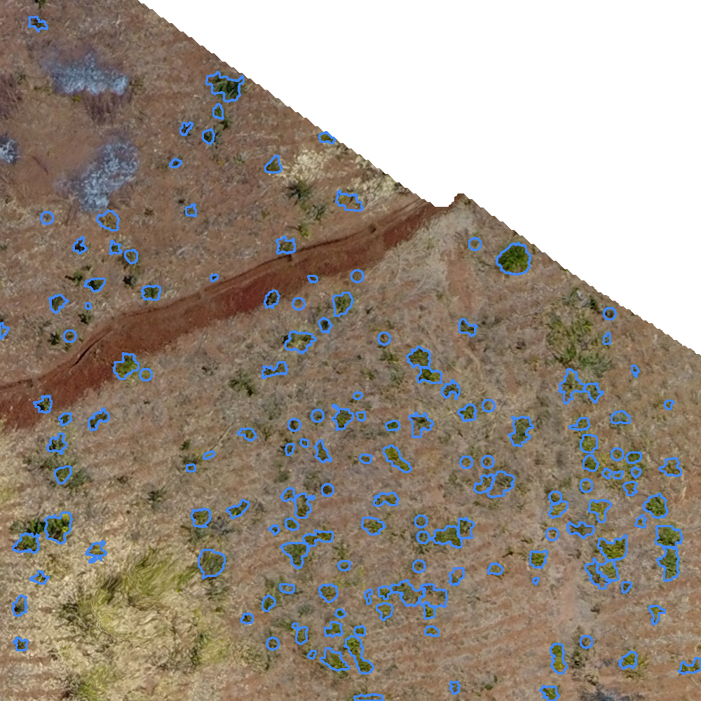

**Link:** [JustDigIt](https://justdiggit.org/news/machine-learning-model-to-track-trees/)

**Location:** Tanzania

Citation status uncertain, contact Tjomme Dooper fruit punch AI.

## Li et al. 2023


**link** [Manuscript](https://academic.oup.com/pnasnexus/article/2/4/pgad076/7073732?login=false) [github](https://github.com/sizhuoli/TreeCountSegHeight?tab=readme-ov-file)

**Location**: Denmark

## Lefebvre et al. 2024

### Source Name: "Lefebvre et al. 2024"


[Dataset Link](https://www.frdr-dfdr.ca/repo/dataset/9f10a155-c89f-43ee-9864-da28ca436af6)

## Lucas et al. 2024

### Source Name: "Lucas et al. 2024"

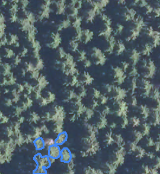

**Link:** [Manuscript](https://www.nw-fva.de/fileadmin/nwfva/publikationen/pdf/lucas_2024_individual_tree_detection_and_crown_delineation_in_the_harz.pdf) 

**Citation** Lucas, Moritz, et al. "Individual tree detection and crown delineation in the Harz National Park from 2009 to 2022 using mask R–CNN and aerial imagery." ISPRS Open Journal of Photogrammetry and Remote Sensing 13 (2024): 100071.

## Kattenborn et al. 2023

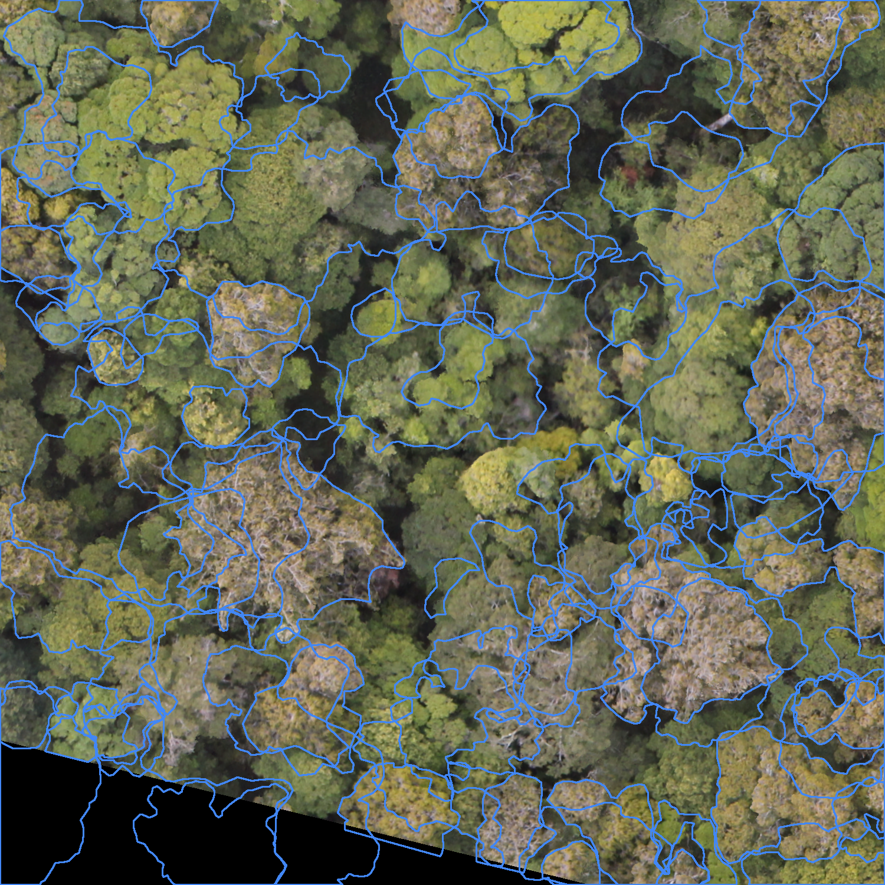

**Link:** [https://zslpublications.onlinelibrary.wiley.com/doi/full/10.1002/rse2.146](https://zslpublications.onlinelibrary.wiley.com/doi/full/10.1002/rse2.146)

**Location:** New Zealand

## Miranda et al. 2024

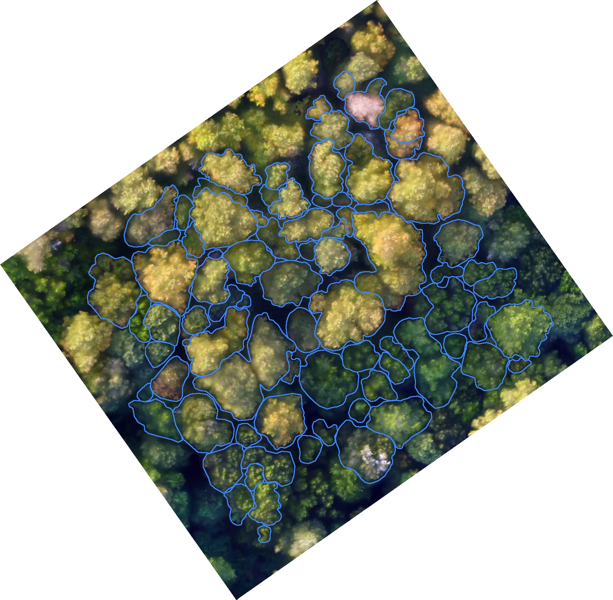

**Link:** [Courtesy of Alejandro Miranda](http://www.lepfor.ufro.cl/)

## Safonova et al. 2021

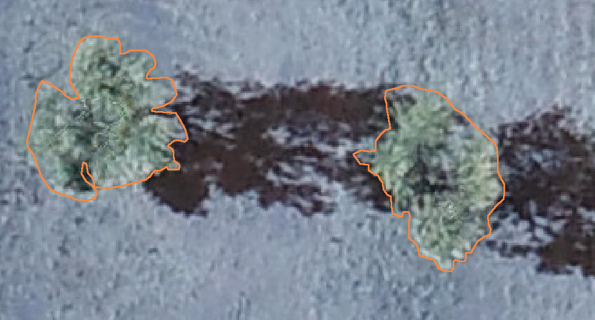

**Link:** [https://www.mdpi.com/1424-8220/21/5/1617](https://www.mdpi.com/1424-8220/21/5/1617)

**Location:** Spain

## Takeshige et al. 2025

### Source Name: "Takeshige et al. 2025"

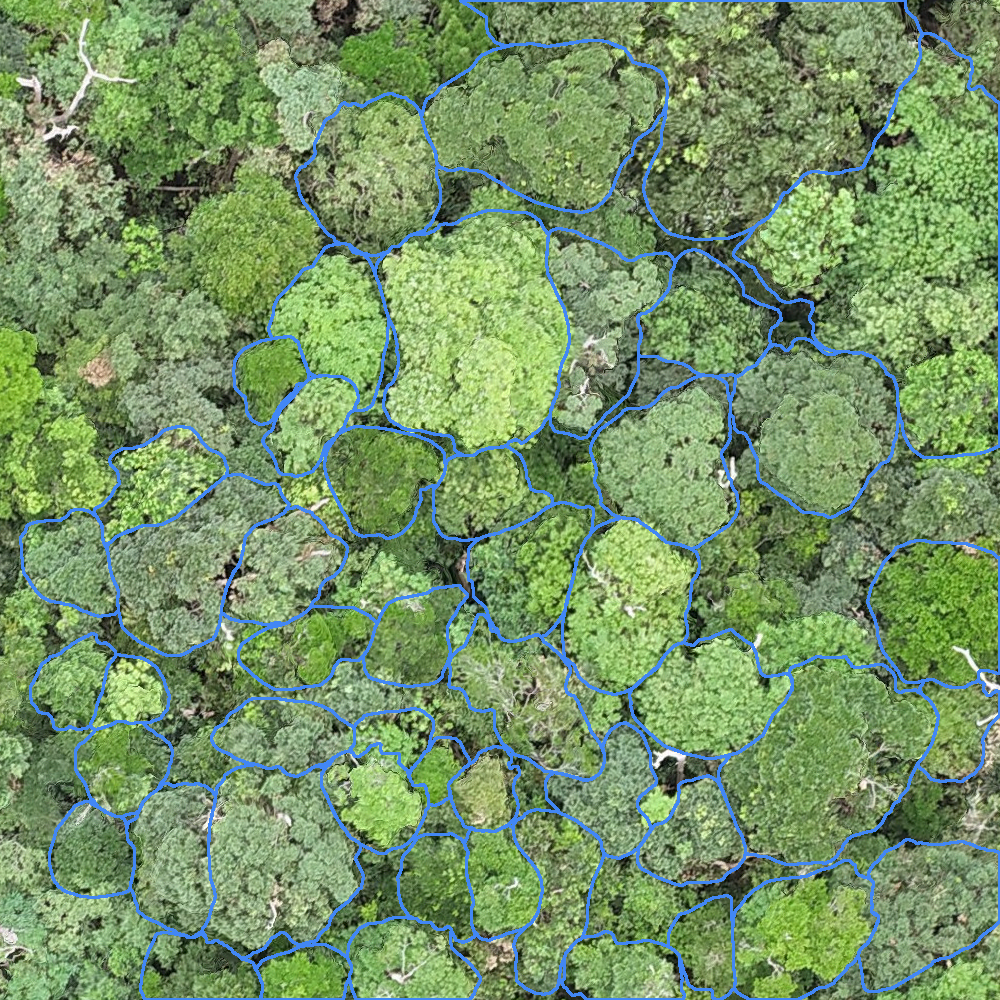

**Link:** https://esj-journals.onlinelibrary.wiley.com/doi/10.1111/1440-1703.12555

**Location:** Japan

## Troles et al. 2024

### Source Name: "Troles et al. 2024"


**Citation:** Troles, J.; Schmid, U.; Fan, W.; Tian, J. BAMFORESTS: Bamberg Benchmark Forest Dataset of Individual Tree Crowns in Very-High-Resolution UAV Images. *Remote Sens.* **2024**, *16*, 1935. https://doi.org/10.3390/rs16111935

**Link:** [https://www.mdpi.com/2072-4292/16/11/1935](https://www.mdpi.com/2072-4292/16/11/1935)

**Location:** Bamberg, Germany

## Wagner et al. 2023


**Link:** [https://www.mdpi.com/2504-446X/7/3/155](https://www.mdpi.com/2504-446X/7/3/155)  
[https://www.mdpi.com/2072-4292/16/11/1935](https://www.mdpi.com/2072-4292/16/11/1935)

**Location:** Australia

## Vasquez et al. 2023


**Link:** [Figshare](https://smithsonian.figshare.com/articles/dataset/Barro_Colorado_Island_50-ha_plot_crown_maps_manually_segmented_and_instance_segmented_/24784053?file=43684731)  

**Location:** Barro Colorado Island, Panama

There is also a training-only portion of this that was used in conjuction with a model to predict labels that were then verified.   

## Allen et al. 2025

### Source Name: "Allen et al. 2025"


**Citation:** Allen, M.J., Owen, H.J.F., Grieve, S.W.D., & Lines, E.R. Manual Labelling Artificially Inflates Deep Learning-Based Segmentation Performance on RGB Images of Closed Canopy: Validation Using TLS. *Remote Sensing of Environment* (in press). [https://arxiv.org/pdf/2503.14273](https://arxiv.org/pdf/2503.14273)

**Location:** Joensuu, Finland (boreal) and Alto Tajo, Spain (Mediterranean)

Crown polygons delineated from co-located terrestrial LiDAR (TLS) following the pipeline in Allen et al. (2025). Orthomosaics are tiled for MillionTrees packaging. This source is **validation-only**: use after training and standard test evaluation for independent TLS ground-truth assessment. Do not use for hyperparameter tuning.

## Khan et al. 2026

### Source Name: "Khan et al. 2026"

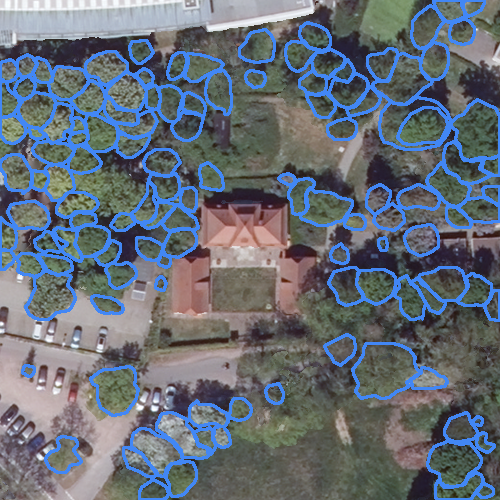

**Link:** [https://zenodo.org/records/19695972](https://zenodo.org/records/19695972)

**DOI:** [https://doi.org/10.5281/zenodo.19695972](https://doi.org/10.5281/zenodo.19695972)

**Location:** Halle (Saale), Germany

DeepTrees-Halle: per-tile polygon shapefiles over the city of Halle. Classes are 0 (tree), 1 (cluster of trees), and 2 (unsure); MillionTrees retains only individual trees (class 0).

## NEON combined crowns

### Source Name: "NEON combined crowns"

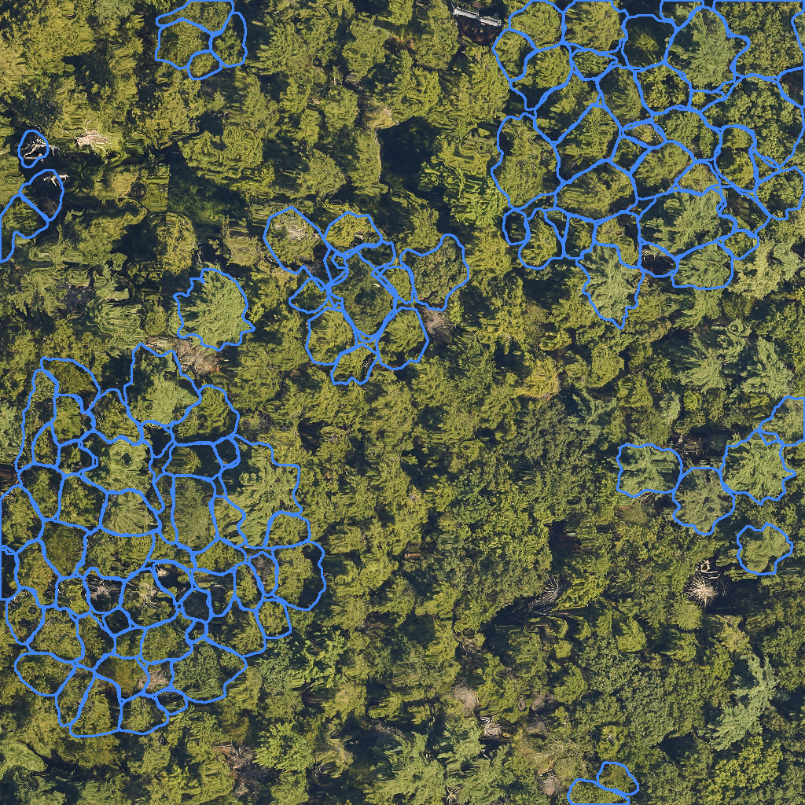

**Location:** Harvard Forest (NEON HARV site), Massachusetts, USA

Field-mapped crown polygons (combined from multiple campaigns at Harvard Forest) paired with NEON AOP high-resolution camera imagery (DP3.30010.001). The crown polygons are merged into a single GeoPackage, draped over the AOP mosaic, and tiled for MillionTrees.

## NEON MultiTemporal

### Source Name: "NEON MultiTemporal"


**Location:** Multiple NEON sites across the United States, multiple flight years

Per-plot bounding box, point, and polygon annotations over NEON AOP camera imagery (`{site}_{plot}_{year}.tif`) for multi-year evaluation. All rows are assigned `existing_split="test"` and are used only for evaluation across geometry types.

## Schütte et al. 2025

### Source Name: "Schütte et al. 2025"


**Location:** Berlin and Osnabrück, Germany

Urban tree crown polygons from the ITCD Urban Berlin/Osnabrück dataset, drawn over 20 cm DOP false-color orthoimagery and tiled for MillionTrees.

## Zuniga-Gonzalez et al. 2023

### Source Name: "Zuniga-Gonzalez et al. 2023"


**Location:** London / Cambridge, United Kingdom

UrbanLondon urban tree crown polygon dataset at 0.25 m GSD with an existing train/test split preserved in MillionTrees.

# Unsupervised

## Weinstein et al. 2018

Coregistered LIDAR and RGB were acquired over 27 sites in the National Ecological Observation Network, USA. These sites cover a range of forest habitats. A weakly supervised LiDAR tree detection algorithm was used to predict tree locations. These locatons were draped over the RGB data to create a very large weakly supervised dataset. There is currently over 40 million tree locations from the original dataset and more can be generated with ongoing data collection.

**Citation**: Weinstein, B.G.; Marconi, S.; Bohlman, S.; Zare, A.; White, E. Individual Tree-Crown Detection in RGB Imagery Using Semi-Supervised Deep Learning Neural Networks. Remote Sens. 2019, 11, 1309. https://doi.org/10.3390/rs11111309

**Location**: Forest across the United States (NEON)

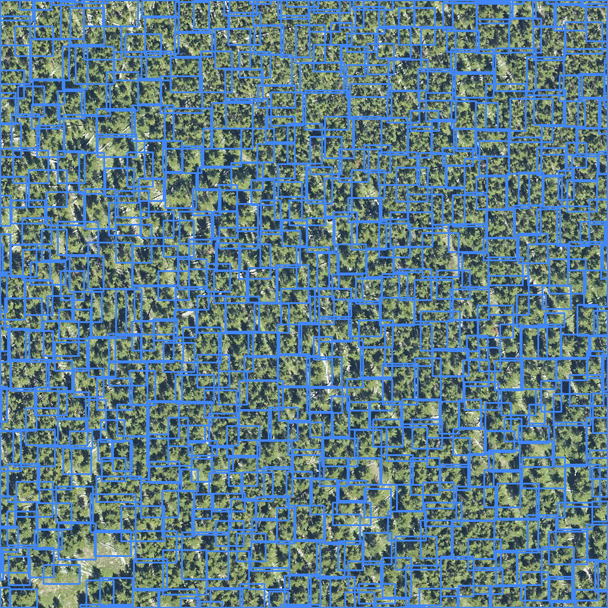

## Open Forest Observatory

High resolution drone imagery used to create photogrametry-derived predictions of tree crowns.

https://openforestobservatory.org/

https://besjournals.onlinelibrary.wiley.com/doi/10.1111/2041-210X.13860

### Source Name: "Young et al. 2025 unsupervised"

***Location*** Forest across the United States

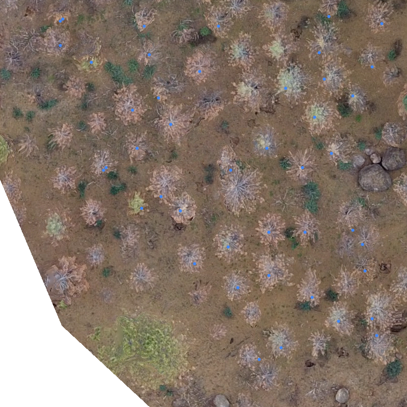
