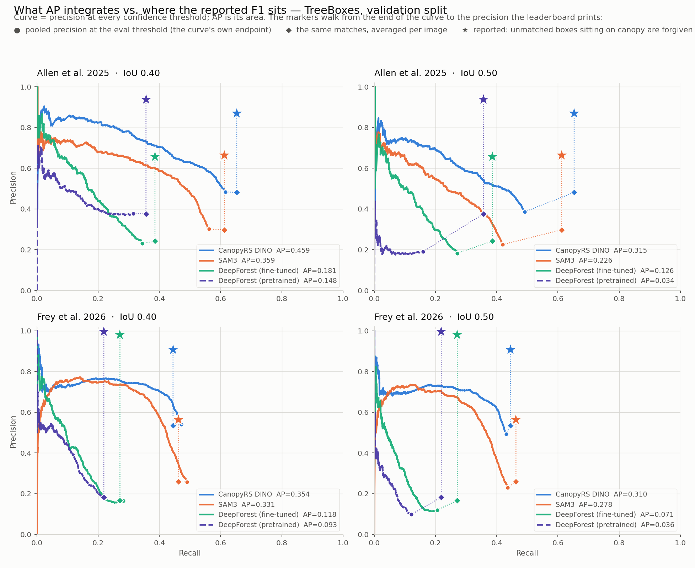
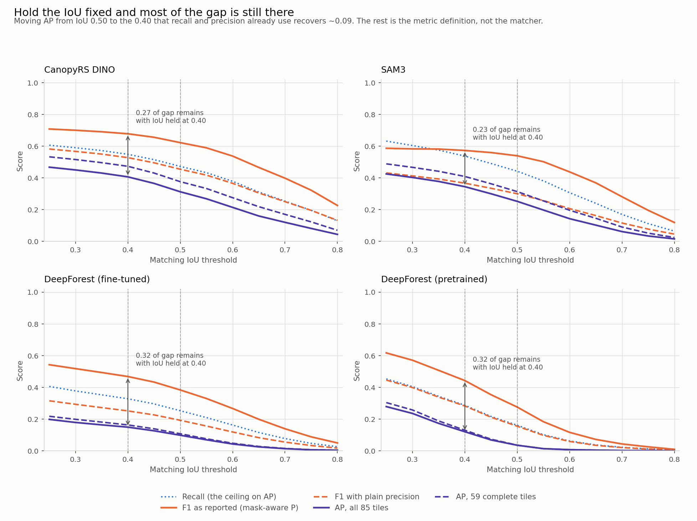
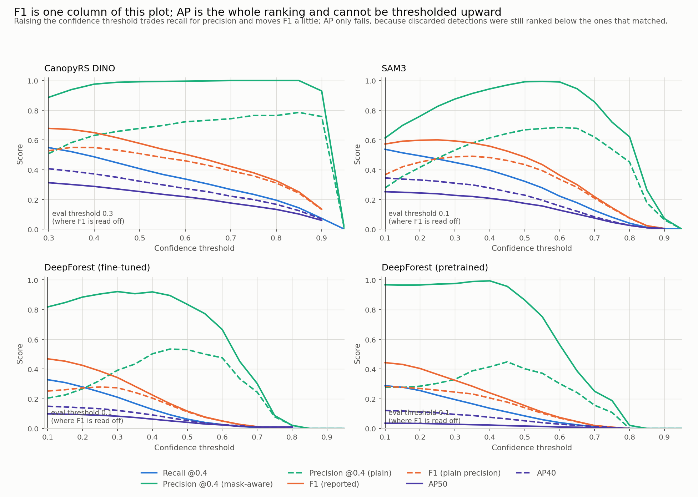
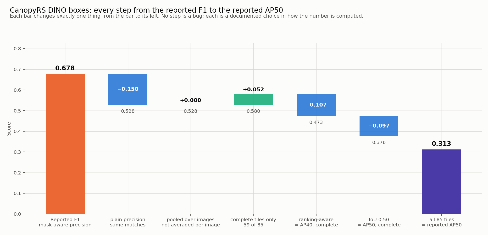

# Seeing the F1 → AP gap: curves, thresholds and IoU

> **Recommendation 1 of this doc has been adopted:** AP is now scored at IoU 0.4 (AP40) project
> wide and AP50 is no longer computed. The AP50 figures below are the diagnosis that led there,
> not current leaderboard values.

Companion to `validation_ap_completeness.md`, which answered *what* drives the gap with a
table. This one draws it. Every number and figure is recomputed from the
`outputs/validation_preds/*_boxes_validation.pkl` dumps by
`scripts/plot_f1_ap_diagnosis.py` — nothing is copied from a results file — and the
reimplementation lands on the published values (CanopyRS AP50 0.313 vs 0.311 reported,
AP40 0.407 vs 0.404, F1 0.678), so the pictures and the leaderboard are describing the
same run.

Dataset **v0.22**, held-out validation split, TreeBoxes, 85 images (24 Allen + 61 Frey).

```bash
uv run python scripts/plot_f1_ap_diagnosis.py \
    --predictions outputs/validation_preds/*boxes*.pkl \
    --data-dir /orange/ewhite/web/public/MillionTrees/TreeBoxes_v0.22 \
    --out-dir docs/public/f1_ap_gap
```

## The one-sentence answer

**F1 and AP50 sit on opposite sides of recall, by construction.** AP can never exceed
recall — with precision 1.0 everywhere the PR curve is a rectangle of height 1 and width
R, so AP ≤ R. F1 is a harmonic mean, so any precision above recall pulls F1 *above* recall.
CanopyRS has recall 0.549 and reported precision 0.887: F1 lands at 0.678, above recall,
while AP50 is capped at 0.549 before a single false positive is counted. Two thirds of the
0.37 "gap" is that structural fact plus the choice of precision; only 0.10 is the IoU.

| | CanopyRS | SAM3 | DeepForest ✓ | DeepForest ✗ |
|---|--:|--:|--:|--:|
| Recall @0.4 = **hard ceiling on AP** | 0.549 | 0.538 | 0.328 | 0.287 |
| Precision @0.4, mask-aware (reported) | 0.887 | 0.613 | 0.818 | 0.967 |
| Precision @0.4, plain | 0.508 | 0.278 | 0.204 | 0.279 |
| **F1 (reported)** | **0.678** | 0.573 | 0.469 | 0.443 |
| F1 with plain precision | 0.528 | 0.367 | 0.252 | 0.283 |
| AP40, all 85 tiles | 0.407 | 0.345 | 0.149 | 0.121 |
| **AP50, all 85 tiles (reported)** | **0.313** | 0.252 | 0.099 | 0.035 |
| AP40, 59 complete tiles | 0.473 | 0.409 | 0.163 | 0.130 |
| AP50, 59 complete tiles | 0.376 | 0.314 | 0.108 | 0.036 |

`docs/public/f1_ap_gap/summary.csv`.

## 1. The curve AP integrates, and where F1 is read off it



The line is precision at every confidence threshold; AP is its area. The three markers walk
from the end of that curve to the number the leaderboard prints, one change at a time:

- **●** the curve's own endpoint — pooled precision at the eval threshold.
- **◆** the same matches, averaged per image instead of pooled. Barely moves.
- **★** the reported precision, after `MaskAwareDetectionPrecision` forgives every unmatched
  box sitting on ≥50 % canopy pixels. This is the long vertical jump, and it is the single
  biggest term in the gap.

Two things worth noticing:

- **The curves are healthy.** CanopyRS holds ~0.75 precision out to recall 0.4 on Frey and
  ~0.8 out to recall 0.3 on Allen. This is not a broken model or a broken metric — it is an
  ordinary detector PR curve that simply stops at recall ≈0.6 because the model does not find
  the remaining trees.
- **DeepForest pretrained is the exception that proves the rule.** At IoU 0.50 its curve
  collapses to ~0.19 precision almost immediately (AP 0.034 on Allen) while its reported
  precision is 0.967. Its boxes are in roughly the right places but are not tight enough to
  clear IoU 0.5, and mask-aware precision forgives all of them because they land on canopy.
  That is why it out-ranks SAM3 on precision and loses to it 7× on AP.

## 2. Hold the IoU fixed — most of the gap survives



Both metrics recomputed at the same matching IoU, swept 0.25 → 0.80. Reading AP and F1 off the
same x = 0.40 (the IoU recall and precision already use) leaves **0.27 of gap for CanopyRS,
0.23 for SAM3, 0.32 for both DeepForests**. Moving AP from 0.50 to 0.40 is worth only
0.05–0.09.

The dotted blue recall line is the AP ceiling. AP tracks below it and F1 above it at every
IoU; the two never approach each other, which is the visual form of the structural point above.

## 3. F1 is one column of a plot; AP is the whole plot



Every metric as a function of the confidence threshold. The vertical rule is where the
leaderboard reads F1 off.

- Raising the threshold trades recall for precision, and F1 is already at its maximum at the
  eval threshold for three of the four models. **AP50 falls monotonically for all four** —
  every discarded detection was still ranked below the ones that matched, so dropping it only
  removes recall the curve had already been credited for. There is no threshold at which AP50
  approaches F1: the gap cannot be tuned away.
- Mask-aware precision (solid aqua) reaches 1.0 for CanopyRS by threshold 0.5 and stays there:
  on ~99 %-canopy imagery, essentially every surviving false positive is forgiven. Plain
  precision (dashed aqua) peaks at 0.786.
- **SAM3 is the one model not evaluated at its best operating point** — its F1 peaks at
  threshold 0.25 (0.601) rather than the 0.10 used (0.573). Small, but worth a look
  independently of this question.

## 4. The full ladder, one change per bar



CanopyRS boxes, macro over sources. Each bar changes exactly one thing from the bar to its
left (`docs/public/f1_ap_gap/gap_waterfall.csv`):

| Step | Value | Δ |
|---|--:|--:|
| Reported F1 (mask-aware precision) | 0.678 | — |
| plain precision, identical matches | 0.528 | **−0.150** |
| pooled over images, not averaged per image | 0.528 | **+0.000** |
| complete tiles only (59 of 85) | 0.580 | +0.052 |
| ranking-aware = AP40, complete tiles | 0.473 | **−0.107** |
| at IoU 0.50 = AP50, complete tiles | 0.376 | −0.097 |
| all 85 tiles = reported AP50 | 0.313 | −0.063 |

Attribution depends on the order of the steps, so read the magnitudes as approximate. Two
results are new relative to `validation_ap_completeness.md`:

- **Image-averaging is not a contributor: it is worth 0.000.** The leaderboard averages
  per image (a 12-tree tile counts as much as a 400-tree tile) while AP pools every detection
  into one ranking. Pooling moves recall 0.549 → 0.544 and precision 0.508 → 0.512 — opposite
  directions, and the harmonic mean lands on 0.528 either way. Ruled out.
- **The ranking-aware step is bigger than previously credited (−0.107, not ~0.06).** With
  completeness now separated out cleanly, the cost of scoring the whole ranked list instead of
  one operating point is the second-largest term after mask-aware precision. This is AP doing
  its job: a detector that ranks a true crown below three false ones is penalised, and F1 at a
  single threshold cannot see that.

## What to do about it

Unchanged from `validation_ap_completeness.md` §4, now with pictures behind each point:

1. **Report AP40 next to F1**, not AP50 — same IoU as the recall/precision columns.
2. **Report validation AP on the 59 complete tiles**, and say so.
3. **State that F1's precision is mask-aware.** A reviewer looking at 0.887 precision beside
   0.313 AP will ask this question, and §1's star-vs-dot picture is the answer.

A fourth, from §1: consider reporting **recall alongside AP** so the ceiling is visible. AP50
0.313 against a ceiling of 0.549 reads very differently from AP50 0.313 against an implied
ceiling of 1.0, and it is the honest framing of what a 0.68 F1 model is actually doing.
