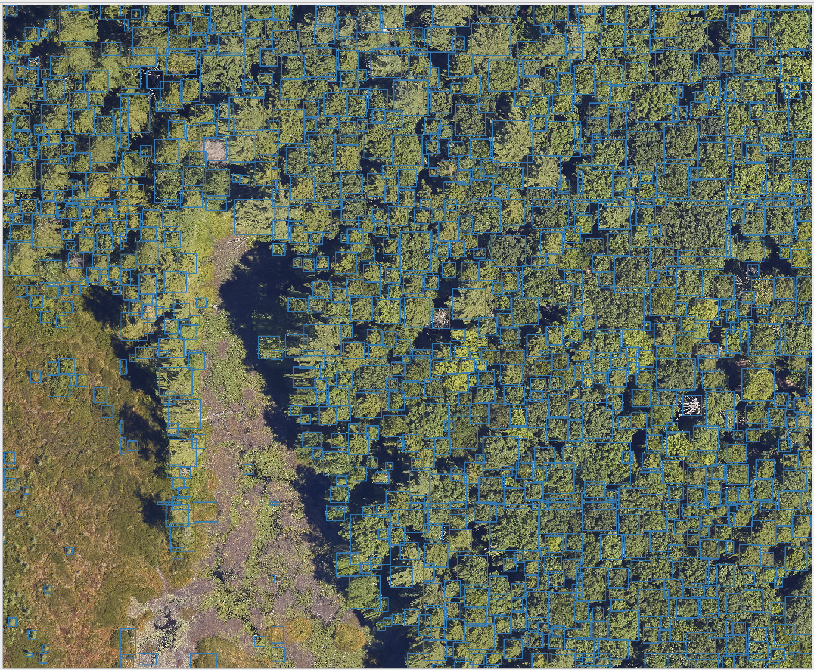
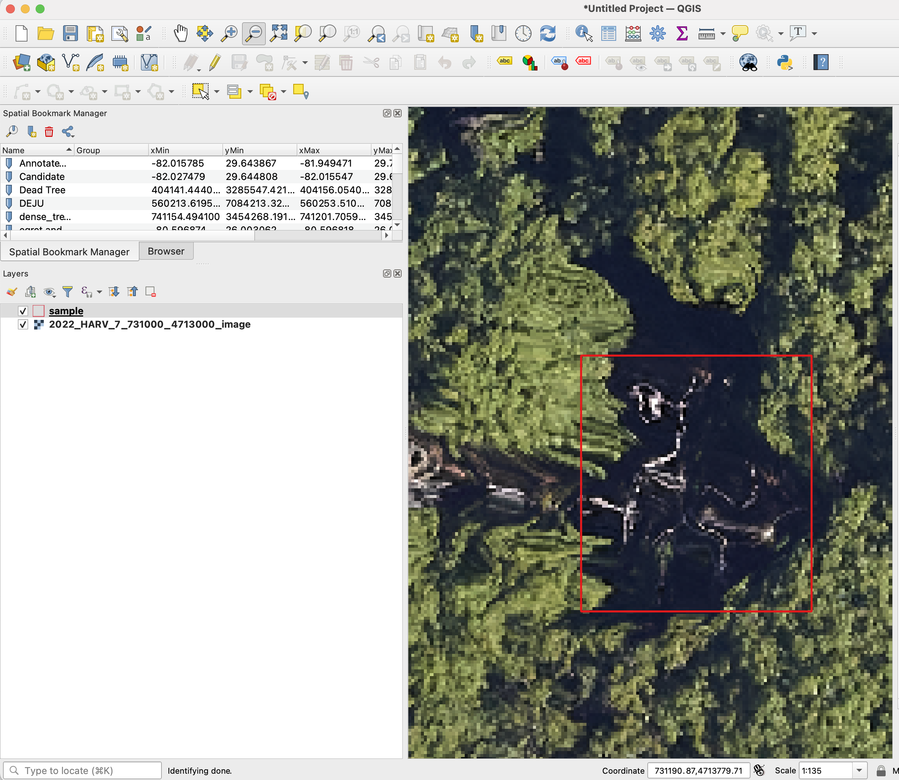
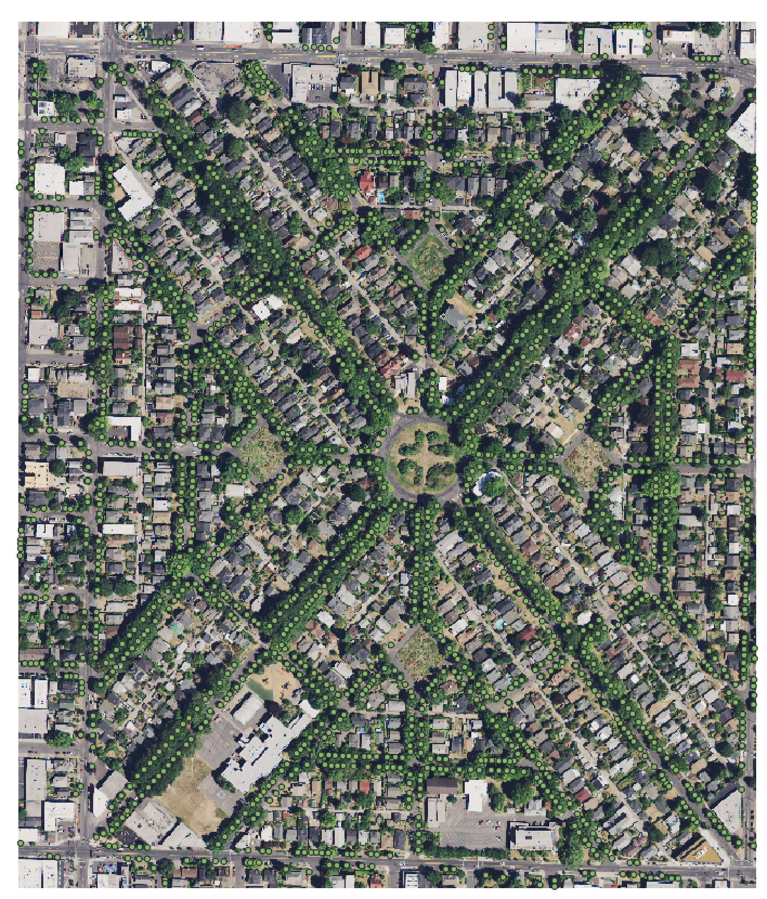

    

        
        
    

The MillionTrees seeks to collect a million tree locations to create a global benchmark for machine learning models for airborne tree prediction. Machine learning models need large amounts of data to generate realistic predictions. Existing benchmarks often have small amounts of data, often less than 10,000 trees, from single geographic locations and resolutions. The MillionTrees will cover a range of backgrounds, taxa, focal views and resolutions. To make this possible, we need your help!

## Contact

* Ben Weinstein, Research Scientist, Weecology Lab, University of Florida.
 ben.weinstein@weecology.org or make an issue on the [repo](https://github.com/weecology/MillionTrees)

# Why do we need this benchmark?

Forests underlie many ecosystem services, agricultural systems and urban planning programs. Monitoring, mapping and measuring forests is an essential task globally. The growth in airborne acquisition tools has led to many attempts to capture tree information from airborne perspectives. At the core of many of these methods is the need to identify individual tree crowns to further process for species, trait, or health information. There have been dozens, if not hundreds, of articles predicting tree locations from airborne sensors. Here we focus on *RGB images* due to their low cost, uniform calibration across manufacturers and high resolution. The vast majority of research articles assess proposed algorithms at one or two locations, often in similar habitat types and with little understanding about generalization across environments, sensors, resolutions, focal views and taxa. To move beyond the duplication and static constriction of the field, we need to tackle a unified concept of tree detection that can be useful across a range of ecosystems, tree densities and taxonomy, as well as handle data from many input types, sensors and focal views. Models should be robust in urban settings to non-tree backgrounds and be quickly customized to new datasets

# How to contribute and what attribution do authors recieve?

* The best way to contribute is to make data available on [Zenodo](https://zenodo.org/), and then make an issue in this repo documenting the location of the data. Your zenodo record will now have a DOI that is citable.

* We are sensitive to the contributions and efforts of the hundreds of field researchers that make data collection possible. Authorship will be extended to any team with unpublished data. 

* The spatial location of the points will be destroyed, such that the point locations will only be relative to the image crop. This will prevent any user from being able to use the data for analysis outside of the benchmark. All species, DBH and other metadata will be removed. For the images, if the geospatial location is the problem, as is it with many datasets, let the provider know that we are destroying the geospatial position, such that we crop images into pieces and remove the coordinate reference system and make any tree annotations relative to the 0,0 image origin, this way we are not releasing any geolocated data that might have privacy issues.

### Removing spatial data projection
We are always happy to help assist in data curation. No actions are needed before sharing data. All data will be treated confidentially and shared according to the bullets above. However, If you prefer to remove the spatial projection before sharing the data, [here is a sample code to convert projected data into unprojected data](https://github.com/weecology/MillionTrees/blob/main/data_prep/destroy_geo.py).

    

        
    

    

        
    

# What does a successful dataset look like?

We welcome any geometric representation of trees in airborne imagery. Points, polygons, or boxes. Usually we ask for a shapefile or text coordinates of trees and a corresponding .tif geospatial file of airborne imagery. When you overlay the two, the data should look coherent. There has been a narrow view of the task that has been overly constrained by off-the-shelf architectures, rather than the essential nature of the task. Tree localization, counting, and crown detection are all interrelated tasks using geometric representations of trees. We should not design benchmarks around current model architectures, we should put the problem first and build architectures that meet that need.

    

        
    

    

        
    

    

        
    

# How will the data be shared?

* After we work with an author to find suitable data sharing agreement we will remove the spatial information from the images and create a Zenodo record to document a train/test split for the benchmark.

* A manuscript, which all contributors are invited to join, will be published outlining the strengths, limitations and potential uses of the dataset.

The working document describing technical details of evaluation is still in its infancy is [here](https://docs.google.com/document/d/1K6G1tcdTuAv3FgGiDWq5QhO-kSoBrxzTiic5jH1CZF4/edit?usp=sharing)

## Datasets that have current been processed

| Annotation Type | Are all trees labeled? | Location                      | Image Resolution | Focal View | Annotations | Source                                                                           | Citation                                                               |
| --------------- | ---------------------- | ----------------------------- | ---------------- | ---------- | ----------- | -------------------------------------------------------------------------------- | ---------------------------------------------------------------------- |
| Box             | Yes                    | Switzerland                   | 10cm             | 40m        | 10144       | https://zenodo.org/records/7528566                                               | Beloiu et al. 2023                                                     |
| Polygon         | Yes (over 5m height)   | California, USA               | 10cm             | 40m        | 45508       | https://zenodo.org/records/7812035                                               | Hemming-Schroeder et al. 2023                                          |
| Point           | Yes                    | London, England               | 20cm             | 204.8      | 686,734     | https://github.com/HAAClassic/TreeFormer                                         | Amirkolaee et al. 2023                                                 |
| Polygon         | No                     | Northern Territory, Australia | 2cm              | \-         | 2547        | [https://doi.org/10.5281/zenodo.7094916](https://doi.org/10.5281/zenodo.7094916) | [(Jansen et al., 2023)](https://www.zotero.org/google-docs/?ez5XxX)    |
| Polygon         | Yes                    | Quebec, Canada                | 2cm              | \-         | 22933       | https://zenodo.org/records/8148479                                               | [(Cloutier et al., 2023)](https://www.zotero.org/google-docs/?ebYv5P)  |
| Boxes           | Yes                    | Västergötland, Sweden         | ~10cm            | 150m       | 102067      | https://lila.science/datasets/forest-damages-larch-casebearer/                   | *                                                                   |
| Boxes           | Yes                    | NEON Sites, United States     | 10cm             | 40m        | 6635        | https://zenodo.org/records/5914554#.YfRhcPXMKHE                                  | [(Weinstein et al., 2021)](https://www.zotero.org/google-docs/?MQqhAK) |
| Polygon         | Yes                    | Malaysia, French Guiana       | 10cm             |            | 9739        | https://zenodo.org/records/8136161                                               | Ball et al. 2023                                                       |
| Boxes           | No                     | Ecuador                       | 2cm              | 80m        | 4665        | https://arxiv.org/pdf/2201.11192.pdf                                             | Reiersen et al. 2023                                                   |
| Polygons        |                        | Siberia, Russia               | 1cm              |            | 18942       | https://doi.org/10.1594/PANGAEA.933263                                           | Kruse et al. 2022                                                      |
| Points          | Yes                    | California, USA               | 60cm             | 150m       | 24563       | https://github.com/jonathanventura/urban-tree-detection                          | [(Ventura et al., 2022)](https://www.zotero.org/google-docs/?oiAnbW)   |

