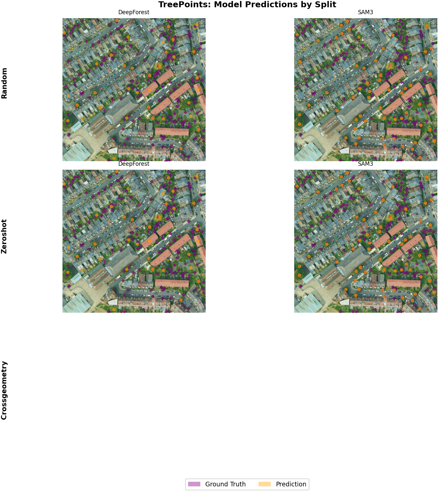
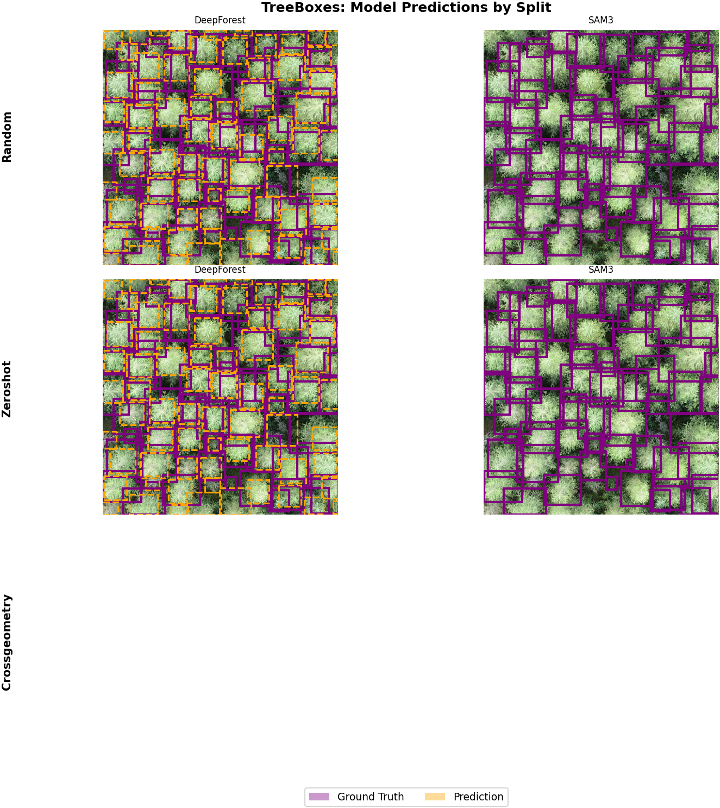
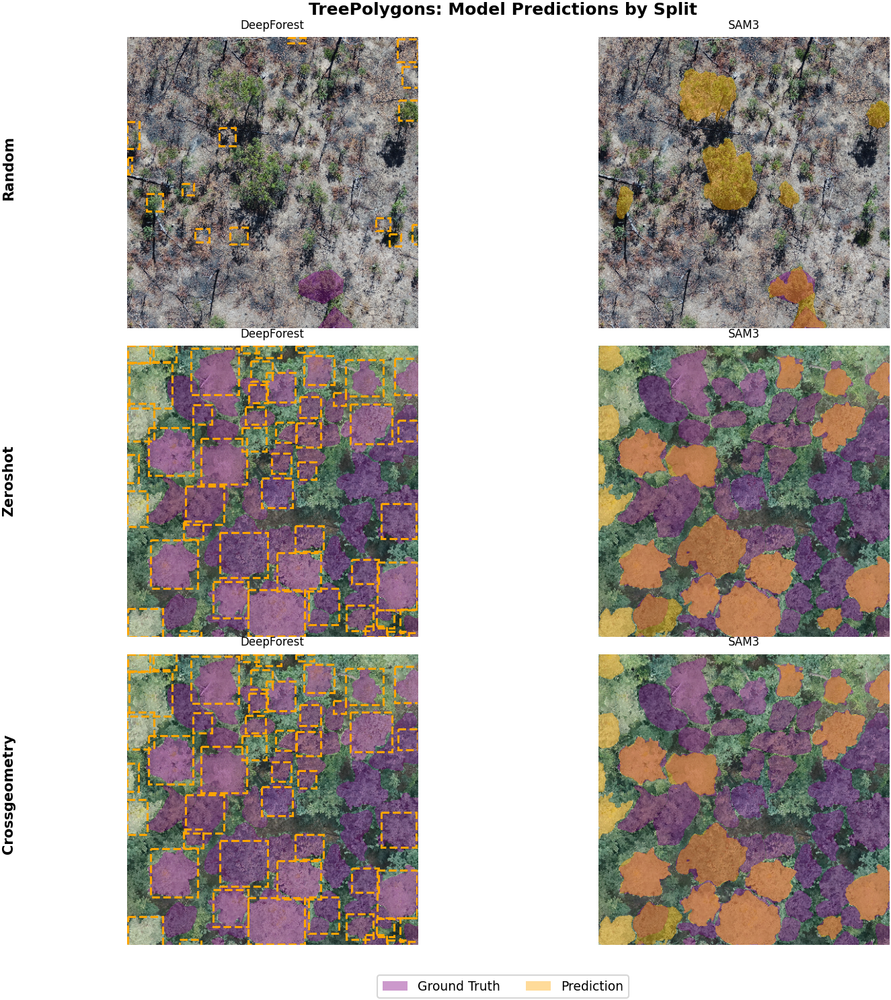

# Leaderboard

# Tasks

## Zero-shot

The first task is to create a zero-shot detection system to generalize across geography and aquisition conditions. Selected datasets are held out from training completely and used for evaluation in new conditions. This is a challenging task with no local training data.

## Random

The second task is to create the best global detector for individual trees given a set of training and test data. Datasets are split randomly, reflecting information within localities. This is consistant with how most applied users engage with models, by fine-tuning backbone models with sample data from a desired locality.

## Cross-geometry

Off the shelf tools often limit users for a single annotation type. We have 'point' models, 'box' models and 'polygon' models. To create truly global models for biological inference, we need models that can use all available data, not just one annotation geometry. In particular, polygon annotations are very time consuming to create, but are often desirable for downstream usecases. We opted against polygon training sources, for example polygons to points, as this is an unrealistic, or atleast, very uncommon downstream use case. 

### Boxes to Polygons

All box sources are used to train and predict all polygon sources. There is no local data from the test localities in train.

### Points to Polygons

All point sources are used to train and predict all polygon sources

### Points to Boxes 

All point sources are used to train and predict all box sources.

# Results

## TreePoints

### Random

| Model | Task | Dataset | Counting MAE | Script |
|---|---|---|---|---|
| SAM3 (`sam3_points.py`) | TreePoints | TreePoints | 23.691 | <small>`uv run python docs/examples/sam3_points.py --device cuda --split-scheme random --hf-token $HF_TOKEN`</small> |
| DeepForest baseline (`baseline_points.py`) | TreePoints | TreePoints | 25.289 | <small>`uv run python docs/examples/baseline_points.py --split-scheme random`</small> |

### Zero-shot

| Model | Task | Dataset | Counting MAE | Script |
|---|---|---|---|---|
| DeepForest baseline (`baseline_points.py`) | TreePoints | TreePoints | 51.462 | <small>`uv run python docs/examples/baseline_points.py --split-scheme zeroshot`</small> |
| SAM3 (`sam3_points.py`) | TreePoints | TreePoints | 55.043 | <small>`uv run python docs/examples/sam3_points.py --device cuda --split-scheme zeroshot --hf-token $HF_TOKEN`</small> |

### Cross-geometry

| Model | Task | Dataset | Counting MAE | Script |
|---|---|---|---|---|
| DeepForest baseline (`baseline_points.py`) | TreePoints | TreePoints | 0.000 | <small>`uv run python docs/examples/baseline_points.py --split-scheme crossgeometry`</small> |
| SAM3 (`sam3_points.py`) | TreePoints | TreePoints | 0.000 | <small>`uv run python docs/examples/sam3_points.py --device cuda --split-scheme crossgeometry --hf-token $HF_TOKEN`</small> |



## TreeBoxes

### Random

| Model | Task | Dataset | Avg Recall | Script |
|---|---|---|---|---|
| DeepForest baseline (`baseline_boxes.py`) | TreeBoxes | TreeBoxes | 0.395 | <small>`uv run python docs/examples/baseline_boxes.py --split-scheme random`</small> |
| SAM3 (`sam3_boxes.py`) | TreeBoxes | TreeBoxes | 0.172 | <small>`uv run python docs/examples/sam3_boxes.py --device cuda --split-scheme random --hf-token $HF_TOKEN`</small> |

### Zero-shot

| Model | Task | Dataset | Avg Recall | Script |
|---|---|---|---|---|
| DeepForest baseline (`baseline_boxes.py`) | TreeBoxes | TreeBoxes | 0.530 | <small>`uv run python docs/examples/baseline_boxes.py --split-scheme zeroshot`</small> |
| SAM3 (`sam3_boxes.py`) | TreeBoxes | TreeBoxes | 0.206 | <small>`uv run python docs/examples/sam3_boxes.py --device cuda --split-scheme zeroshot --hf-token $HF_TOKEN`</small> |

### Cross-geometry

| Model | Task | Dataset | Avg Recall | Script |
|---|---|---|---|---|
| DeepForest baseline (`baseline_boxes.py`) | TreeBoxes | TreeBoxes | 0.000 | <small>`uv run python docs/examples/baseline_boxes.py --split-scheme crossgeometry`</small> |
| SAM3 (`sam3_boxes.py`) | TreeBoxes | TreeBoxes | 0.000 | <small>`uv run python docs/examples/sam3_boxes.py --device cuda --split-scheme crossgeometry --hf-token $HF_TOKEN`</small> |



## TreePolygons

### Random

| Model | Task | Dataset | Avg Mask Accuracy | Script |
|---|---|---|---|---|
| DeepForest baseline (`baseline_polygons.py`) | TreePolygons | TreePolygons | 0.090 | <small>`uv run python docs/examples/baseline_polygons.py --split-scheme random`</small> |
| SAM3 (`sam3_polygons.py`) | TreePolygons | TreePolygons | 0.167 | <small>`uv run python docs/examples/sam3_polygons.py --device cuda --split-scheme random --hf-token $HF_TOKEN`</small> |

### Zero-shot

| Model | Task | Dataset | Avg Mask Accuracy | Script |
|---|---|---|---|---|
| DeepForest baseline (`baseline_polygons.py`) | TreePolygons | TreePolygons | 0.071 | <small>`uv run python docs/examples/baseline_polygons.py --split-scheme zeroshot`</small> |
| SAM3 (`sam3_polygons.py`) | TreePolygons | TreePolygons | 0.322 | <small>`uv run python docs/examples/sam3_polygons.py --device cuda --split-scheme zeroshot --hf-token $HF_TOKEN`</small> |

### Cross-geometry

| Model | Task | Dataset | Avg Mask Accuracy | Script |
|---|---|---|---|---|
| DeepForest baseline (`baseline_polygons.py`) | TreePolygons | TreePolygons | 0.071 | <small>`uv run python docs/examples/baseline_polygons.py --split-scheme crossgeometry`</small> |
| SAM3 (`sam3_polygons.py`) | TreePolygons | TreePolygons | 0.322 | <small>`uv run python docs/examples/sam3_polygons.py --device cuda --split-scheme crossgeometry --hf-token $HF_TOKEN`</small> |



# Submissions

## Submit to the leaderboard

Once you have trained a model and evaluated its performance, you can submit your results to the MillionTrees leaderboard. Here's how:

1. Create a public repository with your code and model training scripts. Make sure to include:
   - Clear instructions for reproducing your results
   - Requirements file listing all dependencies
   - Training configuration files/parameters
   - Code for data preprocessing and augmentation
   - Model architecture definition
   - Evaluation code

2. Generate predictions on the test split:
   ```python
   test_dataset = dataset.get_subset("test")  # Use test split
   test_loader = get_eval_loader("standard", test_dataset, batch_size=16)
   
   predictions = []
   for metadata, images, _ in test_loader:
       pred = model(images)
       predictions.append(pred)
   ```

3. Save visual examples of your model's predictions:
   ```python
   # Save a few example predictions
   dataset.visualize_predictions(
       predictions[:5], 
       save_dir="prediction_examples/"
   )
   ```

4. Submit a pull request to the [MillionTrees repository](https://github.com/weecology/MillionTrees) with:
   - Link to your code repository
   - Model description and approach
   - Performance metrics on test set
   - Example prediction visualizations
   - Instructions for reproducing results