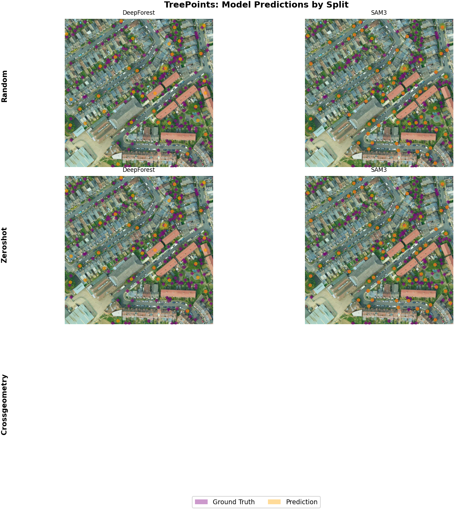
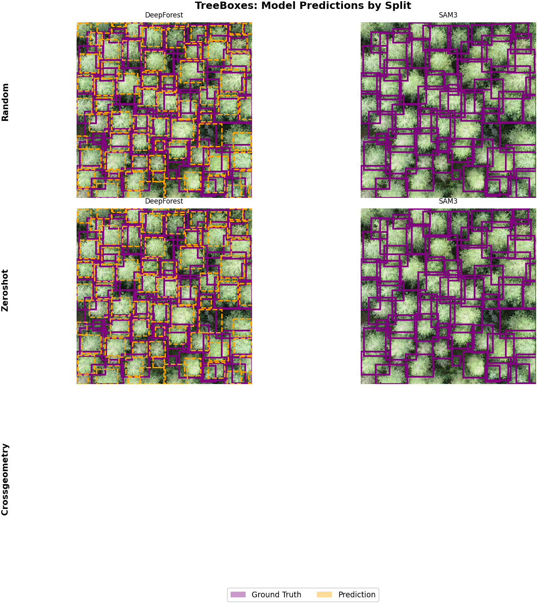
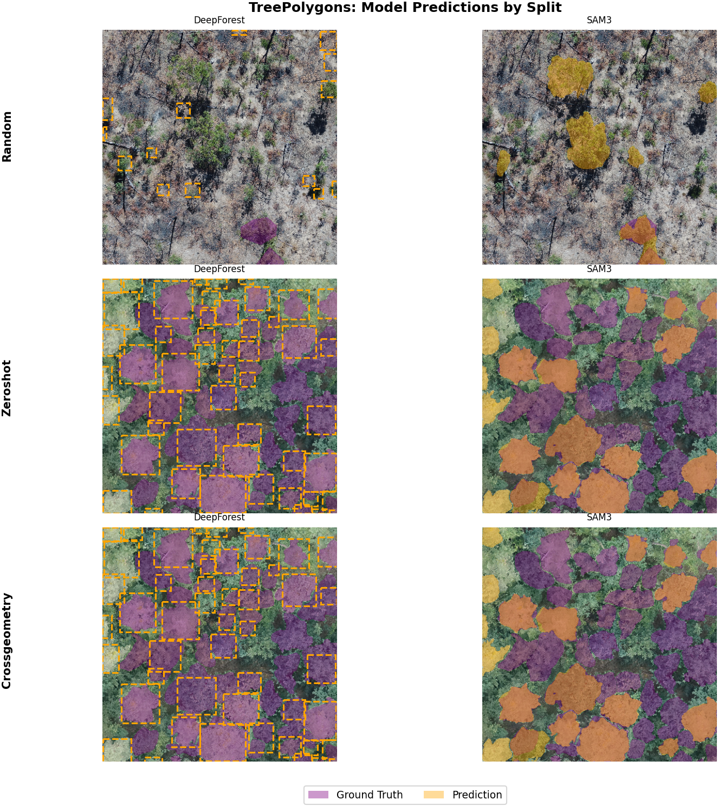

# Leaderboard

# Tasks

## Out-of-distribution

The first task evaluates generalization across geography and acquisition conditions.
Selected source datasets are held out from the train split; models are fine-tuned on
the remaining sources and evaluated on the held-out test sources (no images from test
localities appear in train).

## Within-distribution

The second task is to create the best global detector for individual trees given a set of training and test data. Datasets are split randomly, reflecting information within localities. This is consistent with how most applied users engage with models, by fine-tuning backbone models with sample data from a desired locality.

## Cross-geometry

Off the shelf tools often limit users for a single annotation type. We have 'point' models, 'box' models and 'polygon' models. To create truly global models for biological inference, we need models that can use all available data, not just one annotation geometry. In particular, polygon annotations are very time consuming to create, but are often desirable for downstream usecases. We opted against polygon training sources, for example polygons to points, as this is an unrealistic, or atleast, very uncommon downstream use case.

### Boxes to Polygons

All box sources are used to train and predict all polygon sources. There is no local data from the test localities in train.

### Points to Polygons

All point sources are used to train and predict all polygon sources

### Points to Boxes

All point sources are used to train and predict all box sources.

# Results

Fine-tuned panel figures (within-distribution + out-of-distribution splits, ground truth vs prediction) are
generated from training checkpoints via `scripts/create_finetuned_visualizations.py`
(PNG + SVG under `docs/`). See [repository_structure.md](repository_structure.md).

## TreePoints

Fine-tuned (✓) rows train on the MillionTrees train split (`training/points/train.py`);
pretrained (✗) rows evaluate released weights on the test split with no MillionTrees
training. The TreeFormer ✗ rows use the KCL TreeFormer HF checkpoint
(J. Veitch-Michaelis, `$KCL_CHECKPOINT` = `/home/veitchmichaelisj/code/DeepForest_jvm/kcl_hf_checkpoint`),
evaluated via `training/points/eval.py` (2026-06-10).
The TreeFormer point model needs `uv sync --group treeformer` (DeepForest
[`treeformer-training`](https://github.com/jveitchmichaelis/DeepForest/tree/treeformer-training)
branch until merged to main).

### Within-distribution

| Model | Fine-tuned | Counting MAE | Mask-Aware Precision | Script |
|---|:---:|---|---|---|
| TreeFormer | ✗ | 53.150 | 0.830 | <small>`uv run --group treeformer python training/points/eval.py --checkpoint $KCL_CHECKPOINT --split-scheme within-distribution`</small> |
| SAM3 | ✗ | 54.593 | 0.711 | <small>`uv run python existing_models/sam3/eval_points.py --device cuda --split-scheme within-distribution --hf-token $HF_TOKEN`</small> |
| TreeFormer | ✓ | 57.523 | 0.782 | <small>`uv run --group treeformer python training/points/train.py --split-scheme within-distribution`</small> |

### Out-of-distribution split

Fine-tuned (✓) rows train on the out-of-distribution **train** split (non-held-out sources)
and are scored on geographically held-out **test** sources. Pretrained (✗) rows use a
released checkpoint with no MillionTrees training at all.

| Model | Fine-tuned | Counting MAE | Mask-Aware Precision | Script |
|---|:---:|---|---|---|
| TreeFormer | ✗ | 16.451 | 0.789 | <small>`uv run --group treeformer python training/points/eval.py --checkpoint $KCL_CHECKPOINT --split-scheme out-of-distribution`</small> |
| SAM3 | ✗ | 14.878 | 0.759 | <small>`uv run python existing_models/sam3/eval_points.py --device cuda --split-scheme out-of-distribution --hf-token $HF_TOKEN`</small> |
| TreeFormer | ✓ | 17.007 | 0.872 | <small>`uv run --group treeformer python training/points/train.py --split-scheme out-of-distribution`</small> |

### Cross-geometry

> **Note:** Cross-geometry is designed for predicting polygons from other annotation geometries; it is not applicable to point prediction.



## TreeBoxes

### Within-distribution

| Model | Fine-tuned | Avg Recall | Mask-Aware Precision | Script |
|---|:---:|---|---|---|
| CanopyRS DINO Swin-L | ✗ | 0.688 | 0.679 | <small>`python existing_models/canopyrs/eval_boxes.py --device cuda --split-scheme within-distribution`</small> |
| DeepForest | ✓ | 0.547 | 0.592 | <small>`uv run python training/boxes/train.py --split-scheme within-distribution`</small> |
| DeepForest | ✗ | 0.407 | 0.731 | <small>`uv run python existing_models/deepforest/eval_boxes.py --split-scheme within-distribution`</small> |
| SAM3 | ✗ | 0.190 | 0.608 | <small>`uv run python existing_models/sam3/eval_boxes.py --device cuda --split-scheme within-distribution --hf-token $HF_TOKEN`</small> |

### Out-of-distribution

| Model | Fine-tuned | Avg Recall | Mask-Aware Precision | Script |
|---|:---:|---|---|---|
| CanopyRS DINO Swin-L | ✗ | 0.885 | 0.815 | <small>`python existing_models/canopyrs/eval_boxes.py --device cuda --split-scheme out-of-distribution`</small> |
| DeepForest | ✓ | 0.525 | 0.947 | <small>`uv run python training/boxes/train.py --split-scheme out-of-distribution`</small> |
| DeepForest | ✗ | 0.432 | 0.962 | <small>`uv run python existing_models/deepforest/eval_boxes.py --split-scheme out-of-distribution`</small> |
| SAM3 | ✗ | 0.209 | 0.798 | <small>`uv run python existing_models/sam3/eval_boxes.py --device cuda --split-scheme out-of-distribution --hf-token $HF_TOKEN`</small> |

### Cross-geometry

> **Note:** Cross-geometry splits are designed for predicting polygons from other annotation geometries. The 0.000 scores below reflect that this split is not applicable to box prediction.

| Model | Fine-tuned | Avg Recall | Script |
|---|:---:|---|---|
| DeepForest | ✗ | 0.000 | <small>`uv run python existing_models/deepforest/eval_boxes.py --split-scheme crossgeometry`</small> |
| SAM3 | ✗ | 0.000 | <small>`uv run python existing_models/sam3/eval_boxes.py --device cuda --split-scheme crossgeometry --hf-token $HF_TOKEN`</small> |



## TreePolygons

Fine-tuned (✓) uses a native Detectron2 Mask R-CNN (`training/polygons/train_detectron2.py`);
this replaces the earlier DeepForest/torchvision Mask R-CNN (`training/polygons/train.py`),
which more than halved AP50 on identical data/metric/eval-scale (an implementation gap, not a
data gap). Pretrained (✗) uses SAM3, detectree2, and CanopyRS DINO + SAM3 (SelvaMask).

### Within-distribution

| Model | Fine-tuned | Mask Recall | Mask-Aware Precision | F1 | Mask Accuracy | AP50 | Script |
|---|:---:|---|---|---|---|---|---|
| Mask R-CNN (Detectron2) | ✓ | 0.652 | 0.921 | 0.764 | 0.368 | 0.389 | <small>`python training/polygons/train_detectron2.py --split-scheme within-distribution`</small> |
| CanopyRS DINO + SAM3 (SelvaMask) | ✗ | 0.842 | 0.541 | 0.659 | 0.135 | 0.326 | <small>`python existing_models/canopyrs/eval_polygons.py --device cuda --split-scheme within-distribution --hf-token $HF_TOKEN`</small> |
| SAM3 | ✗ | 0.576 | 0.621 | 0.598 | 0.176 | 0.249 | <small>`uv run python existing_models/sam3/eval_polygons.py --device cuda --split-scheme within-distribution --hf-token $HF_TOKEN`</small> |
| detectree2 | ✗ | 0.530 | 0.604 | 0.565 | 0.137 | 0.186 | <small>`uv run python existing_models/detectree2/eval_polygons.py --split-scheme within-distribution`</small> |

### Out-of-distribution

| Model | Fine-tuned | Mask Recall | Mask-Aware Precision | F1 | Mask Accuracy | AP50 | Script |
|---|:---:|---|---|---|---|---|---|
| Mask R-CNN (Detectron2) | ✓ | 0.555 | 0.904 | 0.688 | 0.331 | 0.347 | <small>`python training/polygons/train_detectron2.py --split-scheme out-of-distribution`</small> |
| CanopyRS DINO + SAM3 (SelvaMask) | ✗ | 0.893 | 0.510 | 0.649 | 0.111 | 0.375 | <small>`python existing_models/canopyrs/eval_polygons.py --device cuda --split-scheme out-of-distribution --hf-token $HF_TOKEN`</small> |
| detectree2 | ✗ | 0.504 | 0.633 | 0.561 | 0.170 | 0.211 | <small>`uv run python existing_models/detectree2/eval_polygons.py --split-scheme out-of-distribution`</small> |
| SAM3 | ✗ | 0.465 | 0.668 | 0.548 | 0.171 | 0.208 | <small>`uv run python existing_models/sam3/eval_polygons.py --device cuda --split-scheme out-of-distribution --hf-token $HF_TOKEN`</small> |

### Cross-geometry

| Model | Fine-tuned | Avg Mask Accuracy | Mask-Aware Precision | Script |
|---|:---:|---|---|---|
| TreeFormer+SAM2 | ✗ | 0.254 | 0.828 | <small>`uv run python existing_models/treeformer_sam2/eval_polygons_crossgeometry.py`</small> |
| SAM3 | ✗ | 0.165 | 0.663 | <small>`uv run python existing_models/sam3/eval_polygons.py --device cuda --split-scheme crossgeometry --hf-token $HF_TOKEN`</small> |



# Submissions

## Submit to the leaderboard

Once you have trained a model and evaluated its performance, you can submit your results to the MillionTrees leaderboard. Here's how:

1. Create a public repository with your code and model training scripts. Make sure to include:
   - Clear instructions for reproducing your results
   - Requirements file listing all dependencies
   - Training configuration files/parameters
   - Code for data preprocessing and augmentation
   - Model architecture definition
   - Evaluation code

2. Generate predictions on the test split:
   ```python
   test_dataset = dataset.get_subset("test")  # Use test split
   test_loader = get_eval_loader("standard", test_dataset, batch_size=16)

   predictions = []
   for metadata, images, _ in test_loader:
       pred = model(images)
       predictions.append(pred)
   ```

3. Submit a pull request to the [MillionTrees repository](https://github.com/weecology/MillionTrees) with:
   - Link to your code repository
   - Model description and approach
   - Performance metrics on test set
   - Example prediction visualizations
   - Instructions for reproducing results

## Benchmark Results

Comparison of fine-tuned models (trained on MillionTrees) vs. pretrained models evaluated zero-shot.

### Split: within-distribution

### TreeBoxes

| Model | DetectionRecall | MaskAwarePrecision | F1 | DetectionAccuracy | CountingMAE |
|---|---|---|---|---|---|
| DeepForest-finetuned | 0.654 | 0.650 | 0.652 | 0.348 | 11.724 |
| CanopyRS-DINO-SwinL | 0.786 | 0.380 | 0.512 | 0.151 | 137.730 |
| SAM3 | 0.561 | 0.434 | 0.489 | 0.183 | 39.094 |
| DeepForest-pretrained | 0.358 | 0.584 | 0.444 | 0.214 | 10.575 |

### TreePoints

| Model | KeypointAccuracy | MaskAwarePrecision | F1 | CountingMAE |
|---|---|---|---|---|
| TreeFormer-finetuned | 0.537 | 0.814 | 0.647 | 54.284 |
| SAM3 | 0.650 | 0.625 | 0.637 | 43.447 |
| TreeFormer-pretrained | 0.460 | 0.859 | 0.599 | 57.951 |

### TreePolygons

| Model | MaskRecall | MaskAwarePrecision | F1 | MaskAccuracy | AP50 |
|---|---|---|---|---|---|
| MaskRCNN-Detectron2-finetuned | 0.652 | 0.921 | 0.764 | 0.368 | 0.389 |
| CanopyRS-DINO-SAM3-SelvaMask | 0.842 | 0.541 | 0.659 | 0.135 | 0.326 |
| SAM3 | 0.576 | 0.621 | 0.598 | 0.176 | 0.249 |
| Detectree2 | 0.530 | 0.604 | 0.565 | 0.137 | 0.186 |

### Split: out-of-distribution

### TreeBoxes

| Model | DetectionRecall | MaskAwarePrecision | F1 | DetectionAccuracy | CountingMAE |
|---|---|---|---|---|---|
| DeepForest-finetuned | 0.616 | 0.727 | 0.667 | 0.335 | 20.844 |
| CanopyRS-DINO-SwinL | 0.924 | 0.506 | 0.654 | 0.196 | 153.618 |
| SAM3 | 0.725 | 0.581 | 0.645 | 0.295 | 40.154 |
| DeepForest-pretrained | 0.465 | 0.781 | 0.583 | 0.304 | 13.104 |

### TreePoints

| Model | KeypointAccuracy | MaskAwarePrecision | F1 | CountingMAE |
|---|---|---|---|---|
| TreeFormer-pretrained | 0.543 | 0.811 | 0.650 | 67.838 |
| SAM3 | 0.681 | 0.621 | 0.650 | 35.838 |
| TreeFormer-finetuned | 0.586 | 0.685 | 0.632 | 59.899 |

### TreePolygons

| Model | MaskRecall | MaskAwarePrecision | F1 | MaskAccuracy | AP50 |
|---|---|---|---|---|---|
| MaskRCNN-Detectron2-finetuned | 0.555 | 0.904 | 0.688 | 0.331 | 0.347 |
| CanopyRS-DINO-SAM3-SelvaMask | 0.893 | 0.510 | 0.649 | 0.111 | 0.375 |
| Detectree2 | 0.504 | 0.633 | 0.561 | 0.170 | 0.211 |
| SAM3 | 0.465 | 0.668 | 0.548 | 0.171 | 0.208 |

