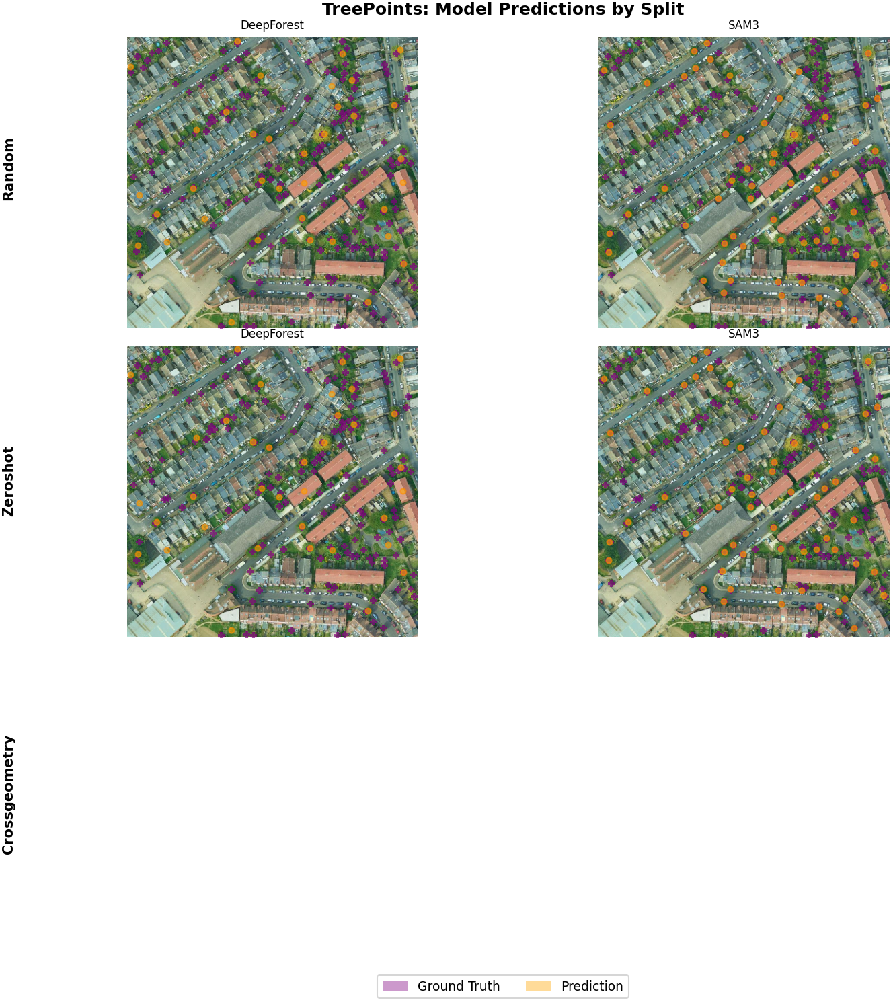
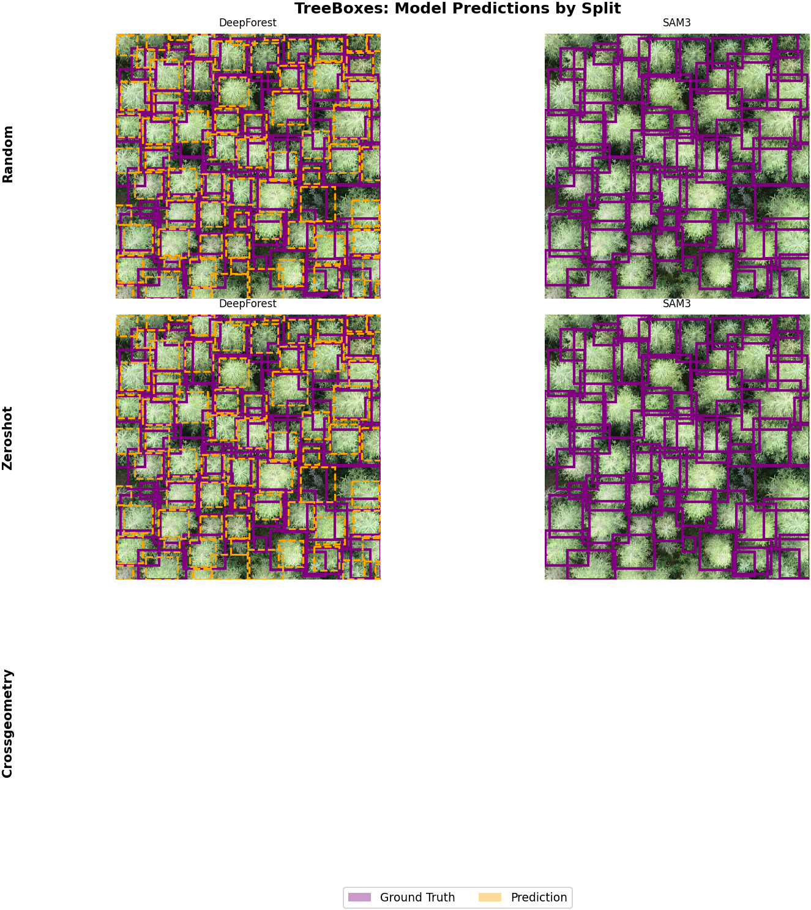
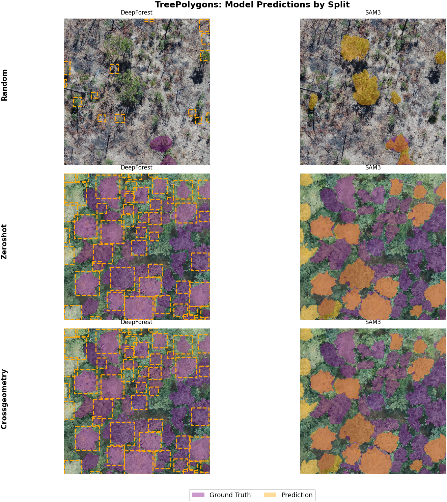

# Leaderboard

# Tasks

## Out-of-distribution

The first task evaluates generalization across geography and acquisition conditions.
Selected source datasets are held out from the train split; models are fine-tuned on
the remaining sources and evaluated on the held-out test sources (no images from test
localities appear in train).

## Within-distribution

The second task is to create the best global detector for individual trees given a set of training and test data. Datasets are split randomly, reflecting information within localities. This is consistent with how most applied users engage with models, by fine-tuning backbone models with sample data from a desired locality.

## Cross-geometry

Off the shelf tools often limit users for a single annotation type. We have 'point' models, 'box' models and 'polygon' models. To create truly global models for biological inference, we need models that can use all available data, not just one annotation geometry. In particular, polygon annotations are very time consuming to create, but are often desirable for downstream usecases. We opted against polygon training sources, for example polygons to points, as this is an unrealistic, or atleast, very uncommon downstream use case.

### Boxes to Polygons

All box sources are used to train and predict all polygon sources. There is no local data from the test localities in train.

### Points to Polygons

All point sources are used to train and predict all polygon sources

### Points to Boxes

All point sources are used to train and predict all box sources.

# Results

All scores below are computed on MillionTrees **v0.23**, on the **test** split of the named
split scheme. Every table in this page is generated from the evaluation result files by
`scripts/make_benchmark_table.py`, which reads an explicit registry of published runs — so
the numbers, and the configuration table that accompanies them, always describe the same run.

Fine-tuned panel figures (within-distribution + out-of-distribution splits, ground truth vs
prediction) are generated from training checkpoints via
`scripts/create_finetuned_visualizations.py` (PNG + SVG under `docs/`).
See [repository_structure.md](repository_structure.md).

## How to read the metrics

- **Recall** is geometry-specific: detection recall (boxes), keypoint accuracy (points),
  or mask recall (polygons).
- **Mask-aware precision** is partial-annotation aware. An unmatched prediction that lands on
  tree-covered pixels is *ignored* rather than counted as a false positive, because most
  MillionTrees sources are incompletely annotated. This is why precision reads high, and it is
  why precision here is not comparable to a standard COCO precision.
- **F1** is the harmonic mean of that recall and that mask-aware precision, computed post-hoc.
- **AP is AP40** — average precision at **IoU 0.4**, the same match threshold recall and
  mask-aware precision use, so AP and F1 agree on what counts as a match. There is no AP50
  column; AP40 runs roughly +0.04 to +0.11 above AP50 on the same predictions, so these numbers
  are not comparable to MillionTrees tables published before 2026-08-04. See
  [notes/ap50_vs_ap40_existing_models.md](https://github.com/weecology/MillionTrees/blob/main/notes/ap50_vs_ap40_existing_models.md).
- **Point matching** uses a GSD-normalized radius per source (a fixed ground distance, not a
  fixed pixel count), so a point prediction is matched at the same real-world tolerance
  regardless of the source's resolution.
- **Counting MAE** is computed only over completely-annotated sources. TreePolygons emits no
  counting metric, so polygon tables have no counting column.

## Reproducing a row

Two things determine a number as much as the model does, and both are recorded in the
**Run configuration** table at the bottom of this page:

1. **Dataset version.** The loaders default to the newest key in their `_versions_dict`, so
   the same command run after a release produces different numbers. Pin it explicitly —
   `TreeBoxesDataset(version="0.23")` — when reproducing anything here. All rows on this page
   are v0.23, supervised sources only (`include_unsupervised=False`, the default).
2. **Score threshold.** The standardized operating point is **0.10**. Two exceptions are
   marked in the configuration table: the CanopyRS box and polygon rows use **0.30**, the
   best-F1 point from a full-test-set sweep (at 0.10 they are badly recall-heavy), and the
   Detectron2 polygon model uses its built-in **0.15** `ROI_HEADS.SCORE_THRESH_TEST`. These are
   per-model tuned exceptions, not a re-standardization.

Beyond those, the configuration table lists the checkpoint, evaluation image size, Python
environment, and full training hyperparameters per row. Note that several published runs
deliberately differ from the script defaults — the point rows run at image size 896 (default
448) with `--loss-preset pretrain`, and the box rows use different early-stopping patience on
each split — so running a bare command from this page without those flags will not reproduce
the number.

### Known caveats

- **Neither the box nor the point trainer sets a random seed**, so those rows are not
  bit-reproducible; expect run-to-run variation. The polygon trainers use seed 42.
- The fine-tuned **polygon** Detectron2 weights predate v0.23; the model is scored on v0.23
  data but was trained on an earlier packaging of it. A v0.23 retrain is pending.
- The fine-tuned **point** row is the count-loss-fixed run (job 39014685). Its held-out
  validation counting error is still substantially worse than the pretrained checkpoint, so
  no fine-tuned point row is published on the validation split.
- **Cross-geometry** is defined as predicting polygons from another annotation geometry. It is
  not applicable to box or point prediction, so those tables are absent rather than zero-filled.







# Submissions

## Submit to the leaderboard

Once you have trained a model and evaluated its performance, you can submit your results to the MillionTrees leaderboard. Here's how:

1. Create a public repository with your code and model training scripts. Make sure to include:
   - Clear instructions for reproducing your results
   - Requirements file listing all dependencies
   - Training configuration files/parameters
   - Code for data preprocessing and augmentation
   - Model architecture definition
   - Evaluation code

2. Generate predictions on the test split, pinning the dataset version explicitly:
   ```python
   dataset = TreeBoxesDataset(version="0.23")  # pin the version; do not rely on the default
   test_dataset = dataset.get_subset("test")   # Use test split
   test_loader = get_eval_loader("standard", test_dataset, batch_size=16)

   predictions = []
   for metadata, images, _ in test_loader:
       pred = model(images)
       predictions.append(pred)
   ```

3. Report the run configuration. A submission is only comparable to the published rows if it
   states each of the following — these are exactly the columns of the **Run configuration**
   table below:

   | Field | Why it matters |
   |---|---|
   | Dataset version and whether unsupervised sources were included | Scores are not comparable across releases |
   | Score threshold | The single largest lever on the recall/precision balance; standard is 0.10 |
   | Weights / checkpoint the score came from | Distinguishes a run from its neighbours in a sweep |
   | Evaluation image size and tiling / inference mode | Changes effective object scale |
   | Training hyperparameters: batch size, GPUs, learning rate, epochs, LR schedule, early stopping / checkpoint-selection criterion, augmentation | Needed to retrain |
   | Random seed, or an explicit statement that none was set | Bounds how much of a difference is noise |
   | Software environment (framework versions, any non-release branch) | Several published rows require specific branches |

4. Submit a pull request to the [MillionTrees repository](https://github.com/weecology/MillionTrees) with:
   - Link to your code repository
   - Model description and approach
   - Performance metrics on test set, with the configuration from step 3
   - Example prediction visualizations
   - Instructions for reproducing results

## Benchmark Results

Fine-tuned models (trained on the MillionTrees train split) vs. pretrained models evaluated zero-shot, all on MillionTrees **v0.23**. All AP is **AP40** (IoU 0.4), the same match threshold behind recall and mask-aware precision; F1 is their harmonic mean. Rows are generated from the result files by `scripts/make_benchmark_table.py` -- see the run configuration table below for what produced each number.

### Split: within-distribution

### TreeBoxes

| Model | Fine-tuned | DetectionRecall | MaskAwarePrecision | F1 | AP40 | CountingMAE |
|---|---|---|---|---|---|---|
| CanopyRS DINO Swin-L | ✗ | 0.664 | 0.776 | 0.716 | 0.488 | 14.495 |
| DeepForest (RetinaNet) | ✓ | 0.635 | 0.611 | 0.623 | 0.467 | 15.570 |
| SAM3 | ✗ | 0.578 | 0.476 | 0.522 | 0.390 | 38.164 |
| DeepForest (release weights) | ✗ | 0.388 | 0.598 | 0.471 | 0.241 | 11.440 |

### TreePoints

| Model | Fine-tuned | KeypointAccuracy | MaskAwarePrecision | F1 | CountingMAE |
|---|---|---|---|---|---|
| TreeFormer (count-loss fix) | ✓ | 0.779 | 0.786 | 0.782 | 19.993 |
| TreeFormer (release weights) | ✗ | 0.741 | 0.711 | 0.726 | 118.665 |
| SAM3 | ✗ | 0.679 | 0.599 | 0.636 | 43.537 |

### TreePolygons

| Model | Fine-tuned | MaskRecall | MaskAwarePrecision | F1 | MaskAccuracy | AP40 |
|---|---|---|---|---|---|---|
| CanopyRS DINO + SAM3 (SelvaMask) | ✗ | 0.762 | 0.874 | 0.814 | 0.268 | 0.375 |
| Mask R-CNN (Detectron2) | ✓ | 0.652 | 0.921 | 0.763 | 0.368 | 0.453 |
| SAM3 | ✗ | 0.576 | 0.621 | 0.598 | 0.176 | 0.290 |
| detectree2 | ✗ | 0.530 | 0.604 | 0.565 | 0.137 | 0.223 |
| DeepForest Mask R-CNN | ✓ | 0.432 | 0.707 | 0.536 | 0.090 | 0.075 |

### Split: out-of-distribution

### TreeBoxes

| Model | Fine-tuned | DetectionRecall | MaskAwarePrecision | F1 | AP40 | CountingMAE |
|---|---|---|---|---|---|---|
| CanopyRS DINO Swin-L | ✗ | 0.799 | 0.865 | 0.831 | 0.662 | 13.792 |
| DeepForest (RetinaNet) | ✓ | 0.644 | 0.759 | 0.697 | 0.480 | 18.060 |
| SAM3 | ✗ | 0.725 | 0.581 | 0.645 | 0.503 | 40.154 |
| DeepForest (release weights) | ✗ | 0.465 | 0.781 | 0.583 | 0.305 | 13.104 |

### TreePoints

| Model | Fine-tuned | KeypointAccuracy | MaskAwarePrecision | F1 | CountingMAE |
|---|---|---|---|---|---|
| TreeFormer (release weights) | ✗ | 0.763 | 0.737 | 0.750 | 66.771 |
| TreeFormer (count-loss fix) | ✓ | 0.688 | 0.662 | 0.675 | 38.398 |
| SAM3 | ✗ | 0.687 | 0.624 | 0.654 | 37.385 |

### TreePolygons

| Model | Fine-tuned | MaskRecall | MaskAwarePrecision | F1 | MaskAccuracy | AP40 |
|---|---|---|---|---|---|---|
| CanopyRS DINO + SAM3 (SelvaMask) | ✗ | 0.819 | 0.861 | 0.839 | 0.291 | 0.417 |
| Mask R-CNN (Detectron2) | ✓ | 0.555 | 0.904 | 0.688 | 0.331 | 0.393 |
| detectree2 | ✗ | 0.504 | 0.633 | 0.561 | 0.170 | 0.253 |
| SAM3 | ✗ | 0.465 | 0.668 | 0.548 | 0.171 | 0.249 |
| DeepForest Mask R-CNN | ✓ | 0.498 | 0.561 | 0.528 | 0.078 | 0.120 |

### Split: crossgeometry

### TreePolygons

| Model | Fine-tuned | MaskRecall | MaskAwarePrecision | F1 | MaskAccuracy | AP40 |
|---|---|---|---|---|---|---|
| TreeFormer + SAM2 | ✗ | 0.464 | 0.653 | 0.543 | 0.179 | 0.211 |

## Run configuration

Everything needed to reproduce a row beyond the dataset version. Score thresholds are the standardized 0.10 unless marked otherwise.

| Model | Geometry | Fine-tuned | Weights / checkpoint | Score threshold | Eval image size | Environment | Training configuration |
|---|---|---|---|---|---|---|---|
| DeepForest (RetinaNet) | TreeBoxes | ✓ | trained from the DeepForest release backbone | 0.10 | native tile | shared `.venv` (`uv run`) | `training/slurm/train_boxes.sbatch`: batch 32 x 2 GPUs, lr 0.01, <=200 epochs, early-stop patience 10 (within) / 15 (OOD), no gradient clipping, no seed set |
| CanopyRS DINO Swin-L | TreeBoxes | ✗ | CanopyRS DINO Swin-L release | **0.30** (per-model tuned; see `notes/canopyrs_threshold_sweep.md`) | CanopyRS default tiling | `existing_models/canopyrs/.venv` | not trained on MillionTrees |
| DeepForest (release weights) | TreeBoxes | ✗ | DeepForest release weights | 0.10 | native tile | deepforest venv | not trained on MillionTrees |
| SAM3 | TreeBoxes | ✗ | `facebook/sam3` | 0.10 | SAM3 default | sam3 venv | not trained on MillionTrees |
| TreeFormer (count-loss fix) | TreePoints | ✓ | `weecology/deepforest-tree-point`, fine-tuned (job 39014685) | 0.10 (`score_integration_radius` 2) | 896 | frozen `.venv-treeformer` (DeepForest `treeformer-training` branch) | `training/slurm/train_points_896_countfix.sbatch`: batch 16 x 3 GPUs, lr 2e-4, 20 epochs, image 896, `--loss-preset pretrain` (enforce_count False, losses count/ot/density_l1, mae_weight 0.025, density_l1_weight 0.05), checkpoint on val_loss, early stopping off, no seed set |
| SAM3 | TreePoints | ✗ | `facebook/sam3` | 0.10 | SAM3 default | sam3 venv | not trained on MillionTrees |
| TreeFormer (release weights) | TreePoints | ✗ | `weecology/deepforest-tree-point` | 0.10 (`score_integration_radius` 2) | 896 | frozen `.venv-treeformer` | not trained on MillionTrees |
| DeepForest Mask R-CNN | TreePolygons | ✓ | torchvision Mask R-CNN, COCO init | 0.10 | 448, tiled stream eval | shared `.venv` (`uv run`) | `training/slurm/train_polygons_deepforest_annotationsafecrop.sbatch`: batch 16, lr 0.01, <=100 epochs, image 448, `--train-aug annotationsafecrop`, `--eval-inference tiled`, `--data-scope subset`, seed 42 |
| Mask R-CNN (Detectron2) | TreePolygons | ✓ | COCO Mask R-CNN R50-FPN 3x; checkpoint `model_final.pth` | 0.15 (`ROI_HEADS.SCORE_THRESH_TEST`) | 448 (`min-size-test` 800, `max-size` 1333) | CanopyRS uv venv (from-source Detectron2) | `training/slurm/train_polygons_detectron2.sbatch`: batch 8, lr 0.01, 50 epochs, image 448, `min-size-train` 640-800, LR steps at 70%/90% of iters, warmup <=1000 iters, seed 42 |
| CanopyRS DINO + SAM3 (SelvaMask) | TreePolygons | ✗ | CanopyRS DINO detector + SAM3 SelvaMask segmenter | **0.30** (per-model tuned) | CanopyRS default tiling | `existing_models/canopyrs/.venv` | not trained on MillionTrees |
| SAM3 | TreePolygons | ✗ | `facebook/sam3` | 0.10 | SAM3 default | sam3 venv | not trained on MillionTrees |
| TreeFormer + SAM2 | TreePolygons | ✗ | TreeFormer points -> SAM2 mask prompting | 0.10 | 896 (points stage) | frozen `.venv-treeformer` + SAM2 | not trained on MillionTrees |
| detectree2 | TreePolygons | ✗ | `250312_flexi.pth` | 0.10 | detectree2 default tiling | detectree2 venv | not trained on MillionTrees |
