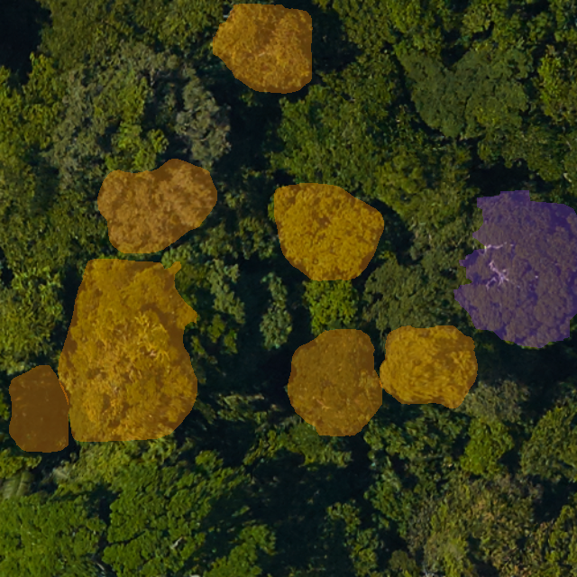
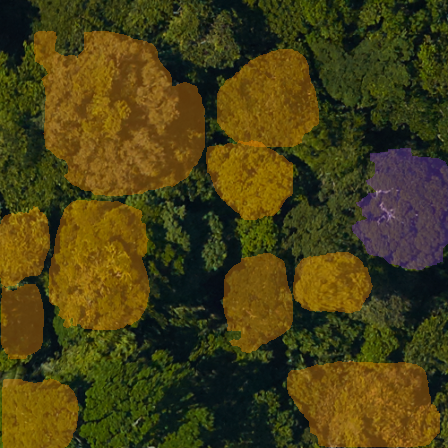
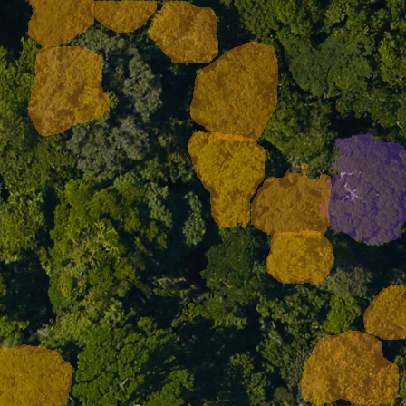
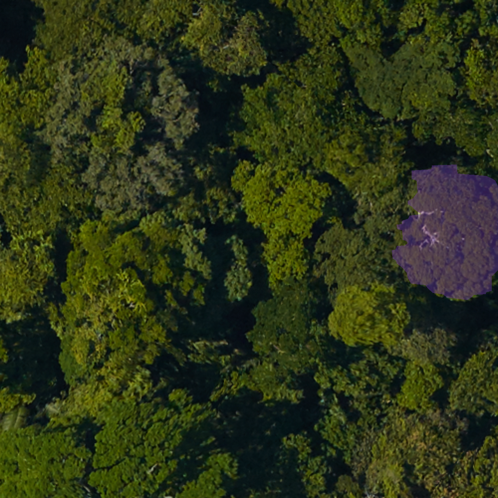

# Polygon training: image size & augmentation review

**Task:** TreePolygons (Mask R-CNN, DeepForest stack, COCO init, lr 0.01). **Data:** v0.20 unless noted.
**Metrics:** Recall / Mask-aware Precision / AP50 on the test split — AP50 (IoU 0.5) was the AP in
force for these runs; AP is now AP40 (IoU 0.4), so these AP values are historical and sit
~0.04–0.11 below what the same runs would score today. Comet project: `bw4sz/milliontrees-polygons`.
**Context:** ~75% of training images are only partially annotated, and the prior torchvision stack reached AP50 ≈ 0.28 (within) — the DeepForest stack has not yet matched it.

---

## 1. Eval image size (fixed model, vary eval input only)

Same trained checkpoint, swept only the evaluation `image_size`. Mask R-CNN already rescales internally (~800 px), so larger input shrinks trees relative to anchors.

| Eval image size | Recall | Mask-aware Prec | AP50 |
|---|---|---|---|
| **448** (≈ train scale) | **0.604** | 0.858 | **0.284** |
| 672 | 0.578 | 0.859 | 0.281 |
| 896 | 0.535 | 0.861 | 0.249 |
| 1280 | 0.478 | 0.861 | 0.215 |

**Takeaway:** Recall and AP50 fall monotonically as eval size grows; precision is flat. Best at native train scale (448). Bigger ≠ better.

---

## 2. Train input strategy (within-distribution, v0.20)

| Strategy | Train input | Eval mode | Recall | Mask-aware Prec | AP50 | Comet |
|---|---|---|---|---|---|---|
| **Resize 640** (control) | whole image → resize+pad 640 | resize 640 (scale-matched) | 0.382 | **0.882** | **0.165** | [ece8bf](https://www.comet.com/bw4sz/milliontrees-polygons/ece8bf38fec04c188de1a1776cf36484) |
| Native crop 640 | RandomCrop 640 at native GSD | tiled native-res | 0.371 | 0.816 | 0.083 | [639e2b](https://www.comet.com/bw4sz/milliontrees-polygons/639e2b9efb4245a6a322cfa6d7d92ec1) |
| RandomResizedCrop | scale 0.64–1.0 → 640 | tiled native-res | 0.341 | 0.812 | 0.081 | [cbf4df](https://www.comet.com/bw4sz/milliontrees-polygons/cbf4df965cc64f548407ee17dde14610) |
| **Resize 1280** | whole image → 1280 | resize 1280 | 0.004 | 0.004 | collapsed¹ | [c0577d](https://www.comet.com/bw4sz/milliontrees-polygons/c0577daeb2ab49648fb093d9f7beb686) |
| Annotation-safe crop | RandomSizedBBoxSafeCrop → 640 | tiled native-res | *in progress* | | | [40a118](https://www.comet.com/bw4sz/milliontrees-polygons/40a118dd4f6c43ba8db8497f5ac8aa37) |

¹ Within-distribution 1280 training diverged (val_loss → NaN, train loss climbing). OOD 1280 survived but trailed 640 (below).

**Takeaway:** Whole-image **resize to 640 with scale-matched eval wins** (AP50 0.165, precision 0.88). Native/random crops lose ~2× AP50 — crops frequently land on unlabeled trees in partially-annotated images, injecting false negatives. 1280 is too aggressive: trees fall to ~4 px and training destabilizes. Annotation-safe crop is the in-flight fix for the blank-crop problem.

---

## 3. Out-of-distribution split

| Strategy | Recall | Mask-aware Prec | AP50 | Comet |
|---|---|---|---|---|
| **Resize 640** | **0.332** | **0.843** | **0.110** | [193d60](https://www.comet.com/bw4sz/milliontrees-polygons/193d60af90fa4d229dd7e570a3dc998d) |
| Resize 1280 | 0.217 | 0.782 | 0.076 | [588471](https://www.comet.com/bw4sz/milliontrees-polygons/588471b5611e447bb8baf7fe83def817) |

Same ranking as within-distribution: 640 > 1280.

---

## 4. Eval projection: squish-448 → tiled native-res

Early DeepForest-integration fix (same checkpoint, eval path only). Old eval squished whole images to 448 → blob masks; new path tiles `predict_tile` over native imagery and projects polygons into metric space.

| Eval path | Recall | Mask-aware Prec | AP50 |
|---|---|---|---|
| Squish-448 (old) | 0.244 | 0.662 | 0.032 |
| Tiled native-res (fix) | 0.249 | 0.668 | **0.052** |

---

## Bottom line

- **Use resize-640 + scale-matched eval** as the polygon recipe — best AP50/precision, stable.
- **Don't push image size up** (1280 hurts or breaks; eval-size sweep peaks at 448).
- **Crops underperform** because of incomplete annotation → testing **annotation-safe crop** next.
- DeepForest stack at AP50 0.165 still trails the old torchvision 0.28; closing that gap is the open item.

*Image comparisons → next page.*

---

# Image comparisons

**Train input strategy — same scene** (Ball et al. 2023, Paracou; within-distribution, v0.20).
**Orange = model prediction, purple = ground truth.** Resize-640 and the crops actively predict crowns; **resize-1280 predicts almost nothing** (recall 0.004).

| Resize 640 — best (AP50 0.165) | Native crop 640 (AP50 0.083) |
|---|---|
|  |  |

| RandomResizedCrop (AP50 0.081) | Resize 1280 — collapsed (recall 0.004) |
|---|---|
|  |  |
